# Bebilderte Funktionsdokumentation der Forschungsumgebung

**Dokumentationsstand: 08.10.2026**

Die Forschungsumgebung unterstützt die Untersuchung der KI-gestützten Migration ausgewählter DVWA-Module nach Laravel. Sie führt von der Konfiguration über die rollenbasierte Codeerzeugung und unabhängige Bewertung bis zu dokumentierten Ergebnissen und deren Nachrechnung. Diese Dokumentation erläutert die Bedienfunktionen anhand aller **40 bereitgestellten Screenshots**.

[Zur README](../README.md) · [Ergebnisdateien und Downloads](../Ergebnisse/README.md) · [Anleitung zur manuellen Prüfung](../docs/anleitung-manuelle-pruefung.md)

## Funktionsumfang im Überblick

| Bereich | Was die Anwendung ermöglicht | Abbildungen |
| --- | --- | --- |
| [Installation und Orientierung](#installation) | Lokaler Dockerstart, Browseroberfläche und Einstieg nach Aufgabe. | 01–03 |
| [Einstellungen](#einstellungen) | Grundausstattung vorbereiten, Modellzugang verwalten, feste Modell-/Providerpakete speichern, Kontexte und Betriebszustand einsehen. | 04–12 |
| [Freie Testläufe](#testlaeufe) | Bedingungen ausprobieren, Pipeline beobachten, Code und Belege prüfen, menschliche Urteile dokumentieren und einzelne Läufe exportieren. | 13–26 |
| [Forschung](#forschung) | Zwölf Bedingungen vorbereiten, Umfang und Reihenfolge festlegen, Matrix fixieren, sichern und geplante Läufe einzeln ausführen. | 27–34 |
| [Auswertung und Datenübergabe](#auswertung) | Laufwerte vergleichen, Studienpakete importieren, gespeicherte Ergebnisse nachrechnen und Tabellen/Abbildungen exportieren. | 35–40 |

**Begriffe:** P ist die Produzentengruppe mit Analyzer, optional Planner, Migrate und gegebenenfalls Repair. V übernimmt Test und optional Review. A/B bezeichnen gespeicherte Modellpakete, K0/K1 die Kontextbedingungen. Ein **Freeze** hält die Bedingungen und geplanten Laufidentitäten fest. **Seal** bezeichnet das Sichern des abschließenden Codebestands eines einzelnen Laufs. Interne Tests gehören zur Generierung; die unabhängige Bewertung folgt anschließend. Die [README](../README.md#reale-modelle-und-unterschiedliche-p-v-zuordnungen) beschreibt den vollständigen Rollenablauf.

### Einordnung der Bildfolge

Die Aufnahmen zeigen mehrere Bestände und Bearbeitungszustände: zunächst die Einrichtung, dann einen freien realen Testlauf, die Vorbereitung der „Test-Reihe“ und schließlich einen importierten Analysestand der Haupterhebung. Demo, freier Test und Hauptdaten sind unterschiedliche Datenarten. Ein grüner Ausführungs- oder Bewertungsstatus belegt nicht automatisch ein fachlich erfolgreiches Ergebnis.

Die Bildunterschriften beschreiben den jeweils sichtbaren Zustand. Noch nicht sichtbare Folgeschritte werden im Text ausdrücklich als solche erläutert. Namen, Modellpreise, Speicherangaben und Messwerte in den Bildern sind Momentaufnahmen. Ergebnisinterpretationen und methodische Schlussfolgerungen sind nicht Gegenstand dieser Bedienbeschreibung.

Alle Abbildungen verwenden unverändert die vom Verfasser bereitgestellten PNG-Dateien im Ordner [Screenshots](Screenshots/). Die Abbildungsnummer entspricht dem Zahlenpräfix des Dateinamens. Ein Klick auf das Bild öffnet die Originalauflösung. Diese Zuordnung und die eigenständigen Bildunterschriften ermöglichen eine spätere Übernahme in den Manuskriptanhang.

<a id="installation"></a>

## 1. Installation und Orientierung

Die Anwendung wird lokal mit Docker betrieben. Die Voraussetzungen für macOS, Linux und Windows/WSL2 sowie Hinweise zu Port und Docker-Zugriff stehen in der [Installationsanleitung](../README.md#installieren-und-starten). Die ersten drei Abbildungen zeigen das Beziehen des Repositories, den erfolgreichen Dienststart und den Einstieg in die Oberfläche.

<a id="abb-01"></a>

### 01. Repository klonen

Der Quellcode wird aus dem öffentlichen GitHub-Repository geladen. Anschließend wird in den Projektordner gewechselt. Dort liegen Startskript, Konfigurationen, Forschungssoftware und die versionierten Ergebnisdateien.

```sh
git clone https://github.com/nofiedler/Bachelorarbeit-Forschungsumgebung-Public.git
cd Bachelorarbeit-Forschungsumgebung-Public
```

Die Aufnahme zeigt das abgeschlossene Klonen und den geöffneten Projektordner. Umfangreiche Ergebnisarchive werden zusätzlich als Release-Dateien bereitgestellt; sie sind nicht automatisch Teil des Clones.

[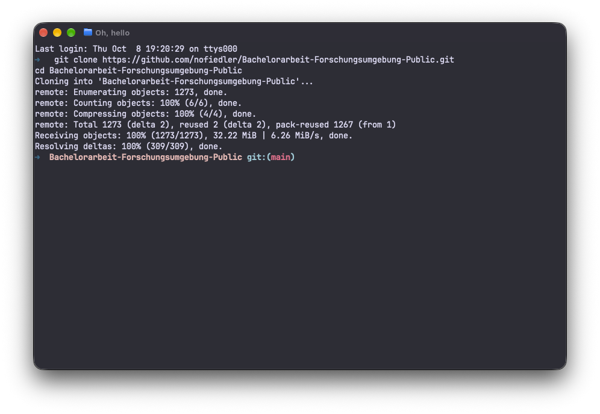](Screenshots/01-Repository_klonen_und_in_den_Ordner_wechseln.png)

*Abbildung 01: Repository klonen und in den lokalen Projektordner wechseln.*

<a id="abb-02"></a>

### 02. Weboberfläche und Worker starten

Im Projektordner startet `./start.sh` die Umgebung. Das Skript bereitet die benötigten Images vor und startet Webdienst und Worker. Im abgebildeten Abschlusszustand werden beide Dienste als **Healthy** gemeldet; die lokale Adresse lautet **http://127.0.0.1:8000**.

Der Start der Anwendung führt noch keine Modellaufrufe aus. Vorhandene Ergebnisse lassen sich ohne neue Generierung ansehen und nachrechnen. Bei einer abweichenden Portkonfiguration ist die entsprechend ausgegebene Adresse zu verwenden.

[](Screenshots/02-Startskript_ausf%C3%BChren.png)

*Abbildung 02: Erfolgreicher Start der lokalen Dienste und Ausgabe der Browseradresse.*

<a id="abb-03"></a>

### 03. Die Startseite als Wegweiser nutzen

Die Startseite erläutert den Forschungsgegenstand und bietet vier Einstiege: **Einrichten**, **Ausprobieren**, **Forschen** und **Auswerten**. Die Navigation führt zu Einstellungen, freien Testläufen, Forschungsreihen und Ergebnissen.

Für einen ersten Durchlauf kann die kostenfreie Demo gewählt werden. Wer vorhandene Daten prüfen möchte, gelangt zum Import und zur Nachrechnung eines Studienpakets. Damit unterstützt die Anwendung sowohl eigene Versuche als auch die spätere Prüfung archivierter Ergebnisse.

[](Screenshots/03-Anwendung_%C3%B6ffnen_und_auf_Startseite_%C3%9Cberblick_verschaffen.png)

*Abbildung 03: Startseite mit den vier Einstiegen zur Einrichtung, Erprobung, Forschung und Auswertung.*

<a id="einstellungen"></a>

## 2. Grundausstattung, Modelle und Betriebszustand

Die Einstellungen verbinden vorbereitete Eingaben, Modellzugang und technische Betriebsinformationen. Ein OpenRouter-Schlüssel ist nur für reale Modellläufe nötig. Die Bilder 05, 07 und 08 zeigen die externe OpenRouter-Oberfläche; die übrigen Bilder dieses Abschnitts zeigen die lokale Forschungsanwendung. Modellnamen, Preise und Anbieterangaben sind der jeweilige Aufnahmezustand und keine aktuelle Empfehlung.

<a id="abb-04"></a>

### 04. Grundausstattung vorbereiten

Unter **Einstellungen** werden zunächst die mitgelieferten Kontextpakete und Werkzeugversionen registriert. Bei einer neuen Installation heißt die Aktion **Grundausstattung vorbereiten**. Die Aufnahme zeigt bereits die Erfolgsmeldung **Grundausstattung vorbereitet**; der Button lautet deshalb **Installierte Grundlagen aktualisieren**.

Der OpenRouter-Zugang ist hier noch nicht eingerichtet. Die technische Vorbereitung startet keine Migration und stellt keine fachliche Abnahme der Forschung dar.

[](Screenshots/04-Einstelungen_%C3%B6ffnen_und_Grundausstattung_vorbereiten.png)

*Abbildung 04: Vorbereitete Grundausstattung bei noch nicht gespeichertem Modellschlüssel.*

<a id="abb-05"></a>

### 05. Einen OpenRouter-Schlüssel anlegen

Für reale Modellläufe wird im eigenen OpenRouter-Konto ein API-Schlüssel angelegt. Die Abbildung zeigt den noch geöffneten Erstellungsdialog mit Name, Ablaufdauer und Kreditlimit. Erst **Create** legt den Schlüssel an; die Aufnahme dokumentiert noch keinen neu erzeugten Schlüssel.

Die gezeigten Kontoeinstellungen sind Beispielwerte. Ein im Anbieter-Konto gesetztes Limit ist von der Forschungsanwendung zu unterscheiden. Nach dem Anlegen wird der Schlüssel für die lokale Einrichtung übernommen; sein vollständiger Wert gehört nicht in die Forschungsdokumentation.

[](Screenshots/05-openrouter_%C3%B6ffnen_und_API-Key_erstellen.png)

*Abbildung 05: OpenRouter-Dialog zur Vorbereitung eines API-Schlüssels mit eigenen Kontoeinstellungen.*

<a id="abb-06"></a>

### 06. Den Schlüssel lokal speichern

Der Schlüssel wird in das Passwortfeld der lokalen Einstellungen eingefügt und gespeichert. Die Aufnahme zeigt den anschließenden Zustand **Schlüssel lokal gespeichert**. Über **Schlüssel ersetzen** oder **Gespeicherten Schlüssel entfernen** lässt sich der Zugang verwalten.

Der gespeicherte Wert wird nicht angezeigt. Die Anwendung hält ihn in einer getrennten lokalen Schlüsselablage und nimmt ihn nicht in Forschungsarchive auf. Das Speichern selbst startet keinen kostenpflichtigen Modelllauf.

[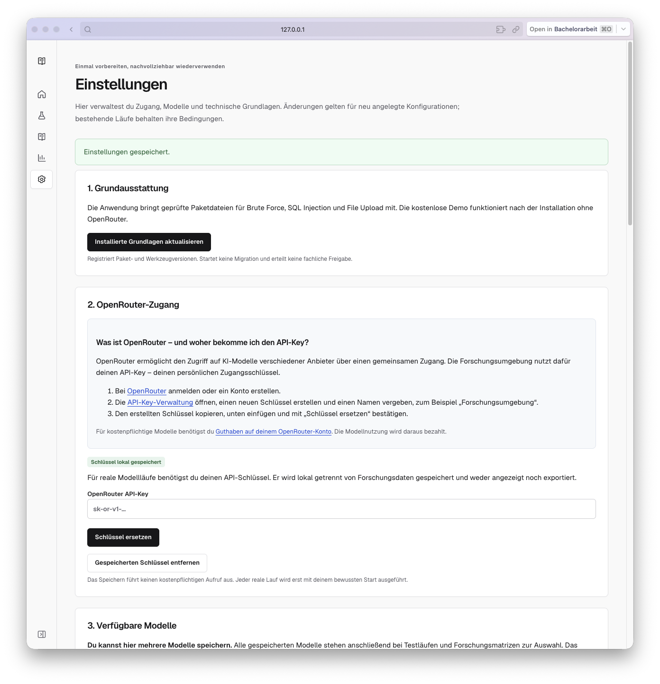](Screenshots/06-Einstellungen_API-Key_eintragen.png)

*Abbildung 06: Gespeicherter OpenRouter-Zugang ohne Anzeige des Schlüsselwerts.*

<a id="abb-07"></a>

### 07. Ein Modell im Anbieter-Katalog suchen

Der externe OpenRouter-Katalog bietet Suche, Filter, Sortierung und Modellkarten. Von dort wird die Detailseite des gewünschten Modells geöffnet.

Für die Forschungsanwendung ist die genaue Modellkennung entscheidend. Die Aufnahme dient zur Orientierung im Katalog. Sichtbare Rangfolgen, Preise und Verfügbarkeit gehören zum damaligen Seitenzustand; eine Versuchsbedingung entsteht erst durch die gespeicherte Modell- und Providerbindung in der lokalen Anwendung.

[](Screenshots/07-openrouter_%C3%B6ffnen_Modelle_ausw%C3%A4hlen.png)

*Abbildung 07: OpenRouter-Modellkatalog mit Such- und Filtermöglichkeiten.*

<a id="abb-08"></a>

### 08. Die genaue Modell-ID übernehmen

Auf der Detailseite steht unter dem Anzeigenamen die kopierbare Modellkennung, im gezeigten Beispiel `openai/gpt-6-luna`. Diese ID wird in die Forschungsanwendung übernommen. Anzeigename, vollständige Seitenadresse und API-Schlüssel sind davon zu unterscheiden.

Die Detailseite enthält außerdem Provider-, Preis- und Kontextinformationen. Für die spätere Konfiguration werden die Metadaten in der Forschungsanwendung geladen und zusammen mit einem festen Endpunkt gespeichert.

[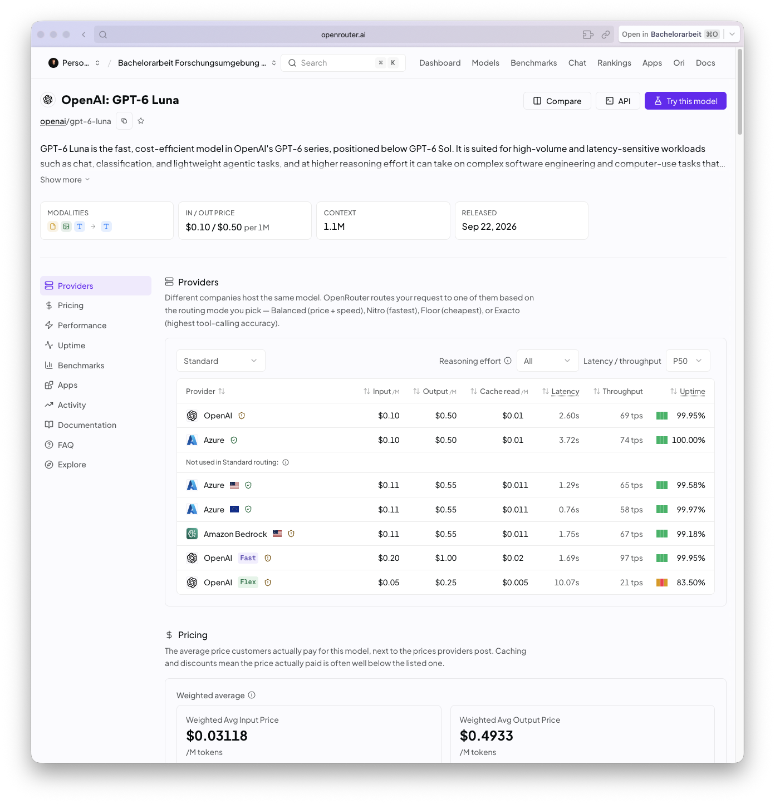](Screenshots/08-openrouter_Modell-ID-kopieren.png)

*Abbildung 08: Modellkennung auf der Detailseite des ausgewählten OpenRouter-Modells.*

<a id="abb-09"></a>

### 09. Modellmetadaten laden und Provider festlegen

Unter **Weiteres Modell hinzufügen** wird die Modell-ID eingetragen. **Aktuelle Modelldaten laden** ruft die zugehörigen Metadaten ab. Danach wird ein fester Provider-Endpunkt ausgewählt; die Aufnahme zeigt diese geöffnete Auswahl. Mit **Dieses Modell zusätzlich speichern** wird die Bindung anschließend in den lokalen Katalog aufgenommen.

Der Metadatenabruf ist kein Modelllauf. Automatische Ersatzmodelle oder wechselnde Provider sind für diese Bindung ausgeschlossen. Eine konkrete Abweichung im abgebildeten Hilfetext ist zu beachten: Das dort genannte Suffixbeispiel `:free` wird vom aktuellen [Provideradapter](../src/research_env/providers.py) als dynamische Routingvariante abgewiesen. Die Anleitung verwendet deshalb feste Modell- und Providerkennungen.

[](Screenshots/09-Einstellungen_Modell-ID_eintragen_und_Anbieter_ausw%C3%A4hlen.png)

*Abbildung 09: Geladene Modellmetadaten und Auswahl eines festen Provider-Endpunkts.*

<a id="abb-10"></a>

### 10. Gespeicherte Modellpakete kontrollieren

Die Tabelle **Verfügbare Modelle** zeigt die kostenfreie Demo und die zusätzlich gespeicherten realen Modelle. Aufklappbare Metadaten machen Providerbindung, Abrufzeit und dokumentierte Parameter sichtbar. Die Aufnahme enthält zwei reale Modellpakete neben der Demo.

In einer späteren Laufkonfiguration werden zwei Katalogeinträge als **A** und **B** ausgewählt. Welche Rollen welches Paket verwenden, bestimmen die Zuordnungen **P** und **V**. Ein Katalogeintrag allein startet keinen Lauf und beweist weder eine Pilotierung noch unveränderte serverseitige Modellgewichte.

[](Screenshots/10-Einstellungen_hinzugef%C3%BCgte_Modelle_einsehen.png)

*Abbildung 10: Lokaler Modellkatalog mit Providerbindung und gespeicherten Metadaten.*

<a id="abb-11"></a>

### 11. Kontextpakete und Agenteneingaben ansehen

Die Paketvorschau erlaubt die Auswahl von Modul und Kontextstufe. Abgebildet ist **Brute Force · K0**. K0 umfasst den Modulcode, den gemeinsamen Zielvertrag und Beschreibungen der gemeinsamen Schnittstellen. Das vollständige Gerüst wird im Rollenaufruf zusätzlich bereitgestellt. K1 ergänzt festgelegte Informationen zu Einbindung und Datenfluss.

Die Ansicht zeigt Paketversion, Umfang und Eingabedateien. Im dargestellten Stand sind die Tokenzahl noch nicht bestimmt und die menschliche Fachprüfung offen. Die Vorschau macht die Inhalte zugänglich, ohne gespeicherte Läufe zu verändern; sie ersetzt nicht das Eingabeprotokoll eines konkreten historischen Rollenaufrufs.

[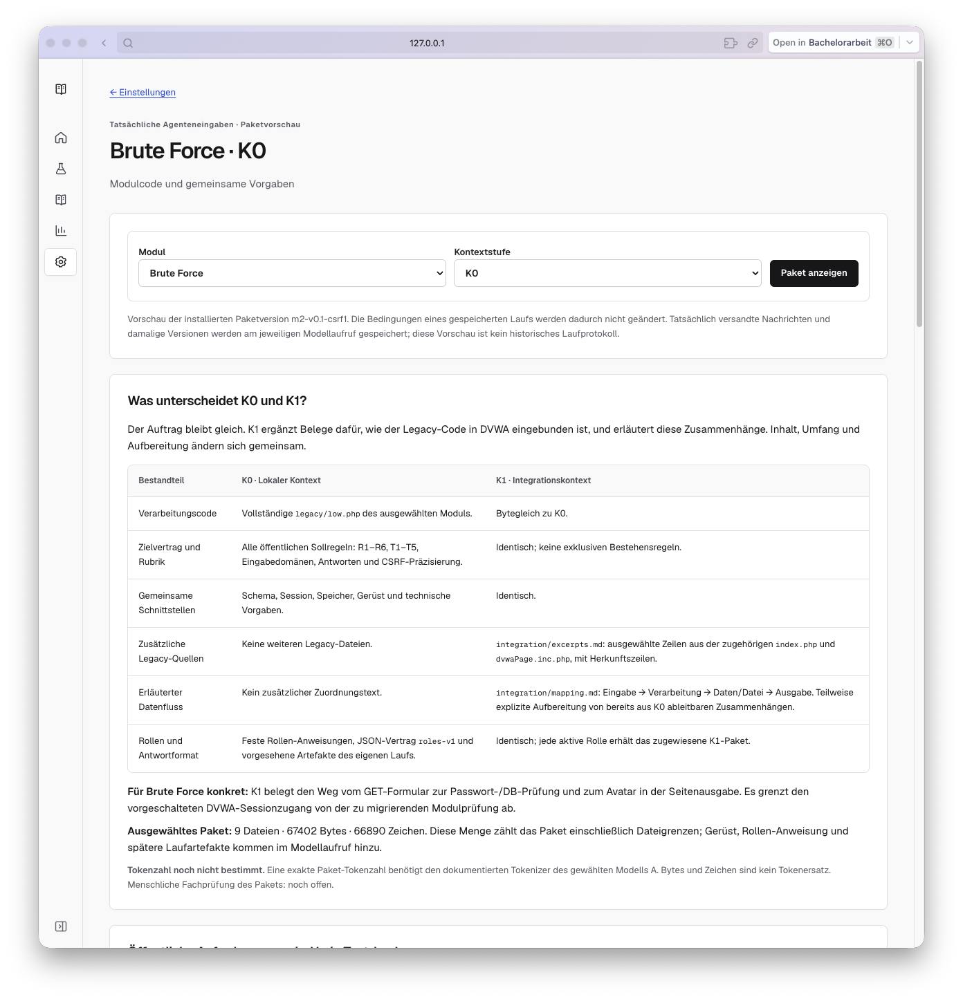](Screenshots/11-Einstellungen_Kontextpakete_einsehen.png)

*Abbildung 11: Kontextpaketvorschau mit Gegenüberstellung von K0 und K1.*

<a id="abb-12"></a>

### 12. Betriebsbereitschaft kontrollieren

Der **Betriebszustand** zeigt Software- und Laufzeitinformationen sowie den Zustand von Speicher, SQLite, Worker, Docker und vorbereiteten Images. In der Aufnahme stehen diese Komponenten auf **Verfügbar**.

Die Statusanzeige hilft dabei, fehlende Voraussetzungen vor einem Lauf zu erkennen. Ein vorhandenes Image für die Netzwerkisolation bedeutet hier, dass das benötigte Asset verfügbar ist; es ist kein gerade ausgeführter Sicherheitstest. Speicherangaben und Versionsnummern beschreiben die abgebildete Installation zum Aufnahmezeitpunkt.

[](Screenshots/12-Einstellungen_Betriebszustand_pr%C3%BCfen.png)

*Abbildung 12: Betriebsstatus der lokalen Speicher, Dienste und vorbereiteten Laufzeitimages.*

<a id="testlaeufe"></a>

## 3. Freie Testläufe durchführen und bewerten

Die Bilder 13–25 dokumentieren einen freien realen Modelllauf mit dem Titel „Testlauf-001“. Dieser gehört nicht zur Hauptversuchsreihe. Reale freie Tests benötigen eine Kostenbestätigung; eine kostenfreie Demo ist eine andere Auswahl mit festgelegten synthetischen Ausgaben. Für die unabhängige Bewertung freier Tests wird die Development-Suite verwendet. Interne, durch die Testrolle erzeugte Prüfungen und die anschließende unabhängige Bewertung bleiben getrennte Schritte.

<a id="abb-13"></a>

### 13. Bedingungen eines freien Testlaufs festlegen

Das Formular erfasst Titel, Modul, K0/K1, Modellpakete A/B sowie die Zuordnung von Produzent **P** und Verifikation **V**. Planner und Review können getrennt aktiviert oder deaktiviert werden.

Im gezeigten Beispiel sind SQL, K1, Planner und Review gewählt. **P und V sind beide Paket A zugeordnet.** Dass zusätzlich ein Paket B ausgewählt ist, bedeutet daher noch keinen Cross-Model-Lauf. **Konfiguration anlegen** speichert zunächst die Bedingungen; an dieser Stelle entstehen keine Modellkosten.

[](Screenshots/13-Testl%C3%A4ufe_Konfiguration_anlegen.png)

*Abbildung 13: Freien Testlauf mit Modul, Kontext, Rollenmodellen und optionalen Rollen konfigurieren.*

<a id="abb-14"></a>

### 14. Konfiguration prüfen und Start bestätigen

Die gespeicherte Zusammenfassung macht die wirksamen Bedingungen vor der Ausführung sichtbar. Im Beispiel verwenden Produktion und Verifikation dasselbe Modell.

Für einen realen Lauf werden Name und Kostenbestätigung erfasst; anschließend wird **Testlauf kostenpflichtig starten** betätigt. Ein gespeicherter Entwurf ist noch kein gestarteter Lauf. Technische Einstellungen können vor dieser Entscheidung aufgeklappt und geprüft werden.

[](Screenshots/14-Testl%C3%A4ufe_Konfiguration_einsehen.png)

*Abbildung 14: Gespeicherte Testbedingungen und ausdrückliche Freigabe eines kostenpflichtigen Starts.*

<a id="abb-15"></a>

### 15. Den Rollenablauf beobachten

Im Reiter **Ablauf** werden abgeschlossene, laufende und wartende Schritte getrennt angezeigt. Die Aufnahme zeigt den bereits erledigten Analyzer und den laufenden Planner. Weitere Schritte warten noch.

Die Navigation führt von derselben Laufidentität zu Ergebnissen, manueller Prüfung, Laravel-Code, Konfiguration und Nachweisen. Solange ein Wert noch nicht feststeht, bleibt er offen. Insbesondere ist ein noch nicht gesicherter Codebestand kein bereits versiegelter Endstand.

[](Screenshots/15-Testlauf_starten_und_%C3%9Cbersicht_einsehen.png)

*Abbildung 15: Laufende Pipeline mit aktiver Rolle, Wartezuständen und Navigation zu den Laufdetails.*

<a id="abb-16"></a>

### 16. Generierung und unabhängige Prüfung unterscheiden

Nach der Generierung zeigt die Ablaufansicht den versiegelten Code und die nachgelagerten Prüfschritte. Im Beispiel waren Repair und erneute interne Prüfung nicht erforderlich und sind als übersprungen dokumentiert.

Messumgebung, funktionale Tests und statische Analyse wurden ausgeführt; die menschliche Laravel-Bewertung steht noch aus. **Erledigt** beschreibt hier den Ausführungsstatus eines Schritts, nicht automatisch ein fachlich bestandenes Ergebnis.

[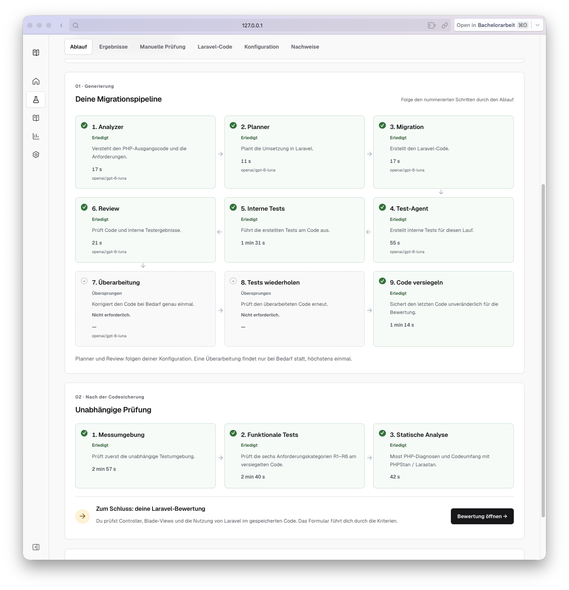](Screenshots/16-Testlauf_Status_einsehen1.png)

*Abbildung 16: Abgeschlossene Generierung und automatische Bewertung bei noch offener menschlicher Prüfung.*

<a id="abb-17"></a>

### 17. Zur manuellen Bewertung wechseln

Der Zustand **Bereit für deine Bewertung** zeigt an, dass die automatische Bearbeitung abgeschlossen ist und die menschlichen Urteile folgen können. Über **Ergebnisse und Bewertung öffnen** wird der gespeicherte Lauf weiter geprüft.

Die Ansicht unterscheidet aktive Pipelinezeit von der gesamten Zeit seit Laufstart. Diese Größen dürfen nicht gleichgesetzt werden. Der Code ist bereits gesichert; die anschließende Bewertung bezieht sich auf diesen unveränderlichen Stand.

[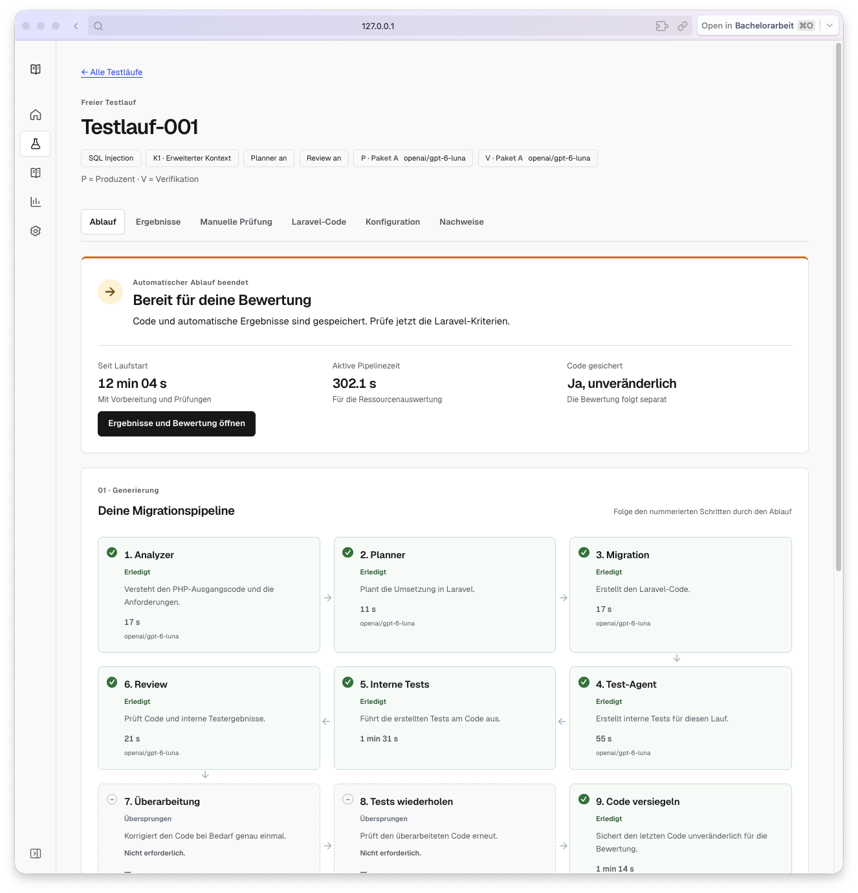](Screenshots/17-Testlauf_Status_einsehen2.png)

*Abbildung 17: Übergang von der automatischen Ausführung zur menschlichen Bewertung des gesicherten Codes.*

<a id="abb-18"></a>

### 18. Zeitverlauf und Ressourcen eines Laufs nachvollziehen

Die Ergebnisansicht zeigt Pipelinezeit, Kostenstatus und den zeitlichen Verlauf der einzelnen Schritte. Beginn, Ende, Dauer und Status bleiben pro Schritt nachvollziehbar. Auch übersprungene Schritte werden aufgeführt.

Die dargestellten Werte beziehen sich auf diesen einzelnen Testlauf. Sie sind keine garantierten Laufzeiten oder Kosten anderer Konfigurationen. Ein vollständiger Kostenbeleg und ein noch offener beziehungsweise unvollständiger Verbrauch sind anhand des jeweiligen Status zu unterscheiden.

[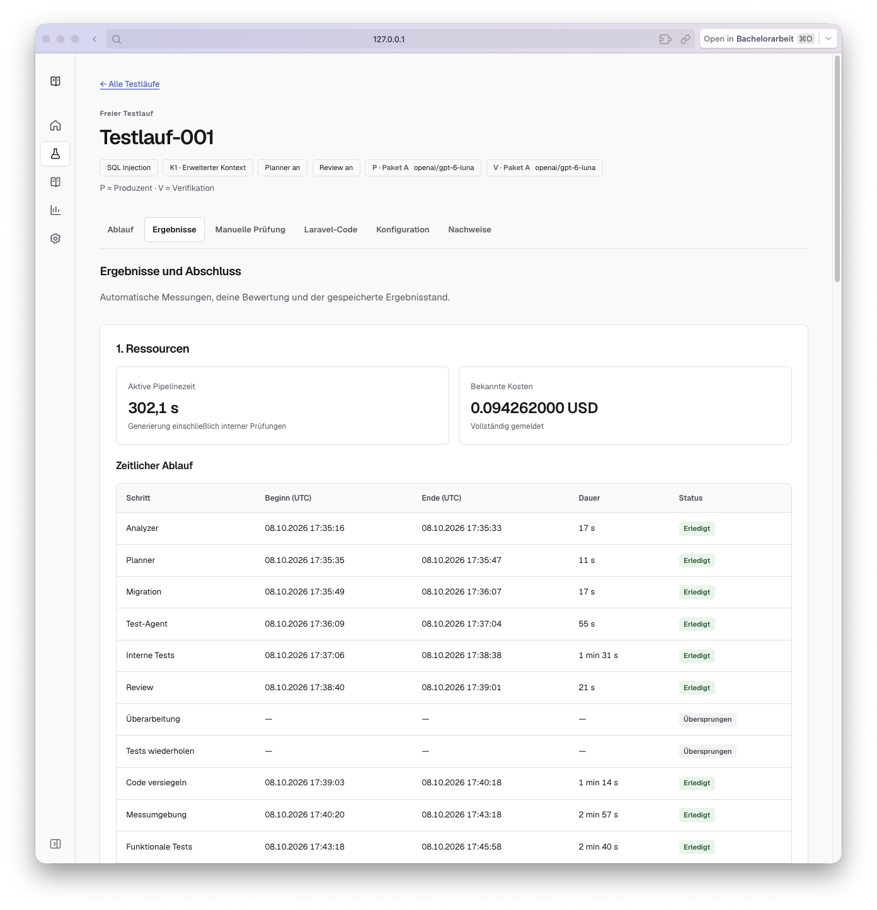](Screenshots/18-Testlauf_Ergebnisse_einsehen.png)

*Abbildung 18: Ressourcenübersicht und zeitlicher Ablauf des einzelnen Testlaufs.*

<a id="abb-19"></a>

### 19. T2–T4 anhand des Codes beurteilen

Die geführte **Manuelle Prüfung** behandelt die Laravel-Zielkriterien T2–T4. In der Aufnahme ist T2 „Controller und Routen“ geöffnet. Hinweise und passende Dateien unterstützen die Prüfung; rechts werden Urteil, Beobachtung, Belegdatei und Zeilen erfasst.

**Noch nicht sicher** bleibt ein offener Entwurf. **Erfüllt** und **Nicht erfüllt** sind begründete Urteile, die am gesicherten Code zu belegen sind. Für T4 werden zusätzlich unabhängige Integrationsbefunde benötigt. Die [Anleitung zur manuellen Prüfung](../docs/anleitung-manuelle-pruefung.md) erläutert die Kriterien und Belegregeln.

[](Screenshots/19-Testlauf_manuelle_Pr%C3%BCfung_durchf%C3%BChren.png)

*Abbildung 19: Geführte Bewertung der Laravel-Zielkriterien mit Beobachtung, Datei- und Zeilenbelegen.*

<a id="abb-20"></a>

### 20. Laravel-Code als Prüfkopie bereitstellen

Unter **Laravel-Code** lassen sich einzelne gesicherte Dateien direkt öffnen oder über **Prüfkopie vorbereiten** zu einer vollständigen lokalen Prüfkopie zusammenstellen. Die Anleitung führt anschließend zum ZIP-Download, Entpacken und zur enthaltenen `START.md`.

Die Aufnahme zeigt die Vorbereitung, noch keinen fertigen Download. Die Prüfkopie enthält auch benötigte Abhängigkeiten und Entwicklungsdaten; die ursprünglichen Laufartefakte bleiben erhalten. Für das reine Lesen des Codes muss das exportierte Projekt nicht gestartet werden.

[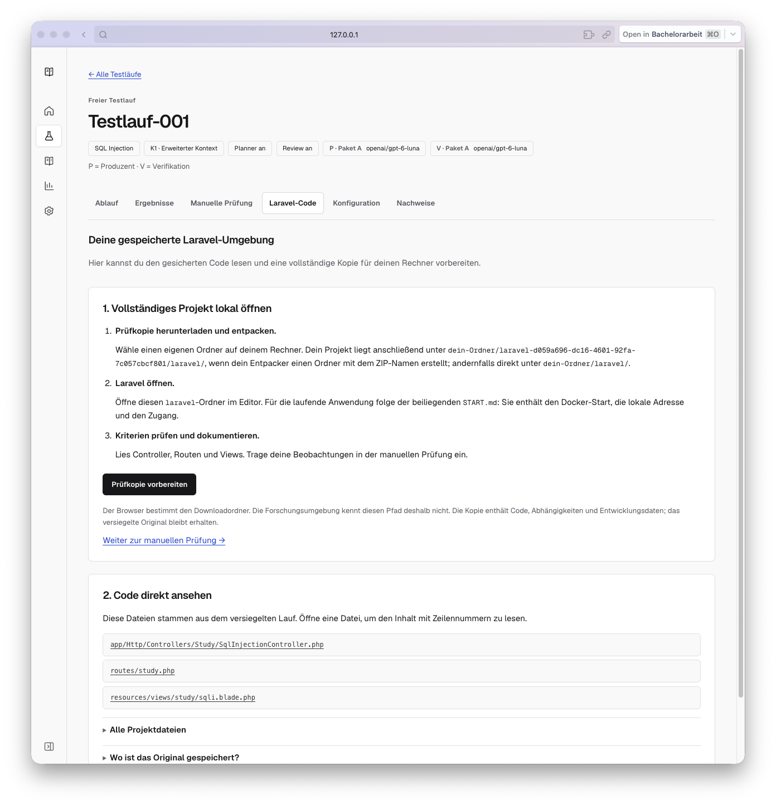](Screenshots/20-Testlauf_Laravel_Code_sichern.png)

*Abbildung 20: Prüfkopie des Laravel-Projekts vorbereiten oder einzelne gesicherte Dateien direkt öffnen.*

<a id="abb-21"></a>

### 21. End- und Zwischenstände in den Nachweisen finden

Im Bereich **Nachweise → Code-Stände** sind der versiegelte Endstand und gespeicherte Zwischenstände auffindbar. Ein Filter unterstützt die Suche nach Dateiname oder Kennung. Weitere Bereiche führen zu Tests und Bewertungen, Dateien und Logs sowie Ablauf und Ressourcen.

Die Nachweise dokumentieren die Herkunft und Entwicklung des Kandidaten. Mehrere Zwischenstände sind keine Auswahlmöglichkeit, nachträglich den günstigsten Endstand als Ergebnis einzusetzen.

[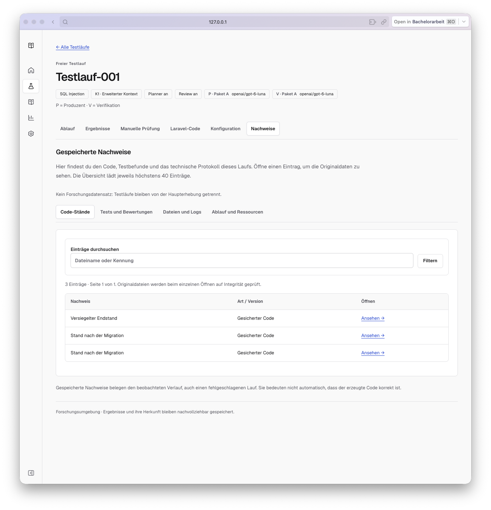](Screenshots/21-Testlauf_Nachweise_einsehen1.png)

*Abbildung 21: Nachweisübersicht der gesicherten End- und Zwischenstände eines Laufs.*

<a id="abb-22"></a>

### 22. Die Dateien eines gesicherten Standes durchsuchen

Ein geöffneter Codestand zeigt die gespeicherten Projektdateien. Dazu gehören sowohl erzeugte Moduldateien als auch Gerüst-, Konfigurations- und Abhängigkeitsdateien. Einzelne Dateien lassen sich aus der Liste aufrufen.

Diese vollständige Projektansicht dient der Nachvollziehbarkeit. Sie ist umfangreicher als der engere Dateibereich, der für das statische Diagnoseprofil des erzeugten Moduls ausgewertet wird.

[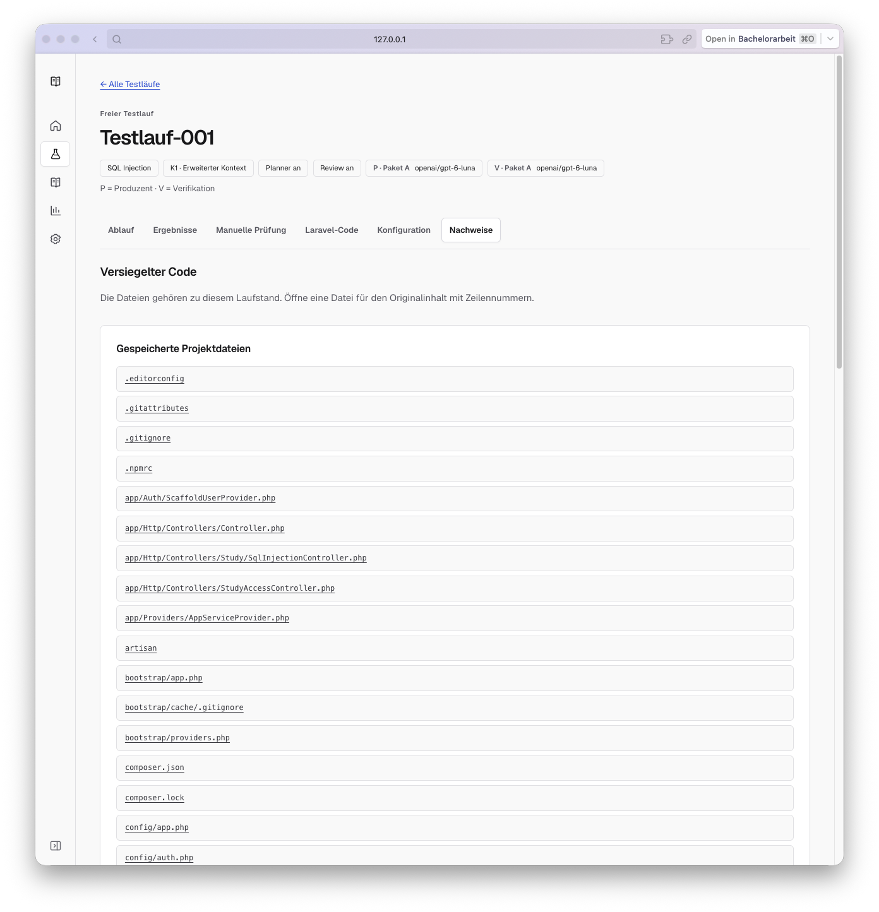](Screenshots/22-Testlauf_Nachweise_einsehen2.png)

*Abbildung 22: Dateiliste des versiegelten Projektstands mit einzeln zugänglichen Originaldateien.*

<a id="abb-23"></a>

### 23. Originalcode mit Zeilennummern prüfen

Die Einzeldateiansicht zeigt den gesicherten Quelltext mit Syntaxhervorhebung und Zeilennummern. Ein Download stellt den Originalinhalt bereit; aufklappbare Angaben dokumentieren Herkunft und Integrität.

Die abgebildete Blade-Datei wird als Quelltext angezeigt, nicht als ausgeführte Webseite. Die Zeilenansicht unterstützt konkrete Bewertungsbelege. Allein die Existenz einer Blade-Datei beweist jedoch noch nicht die Erfüllung des entsprechenden Zielkriteriums.

[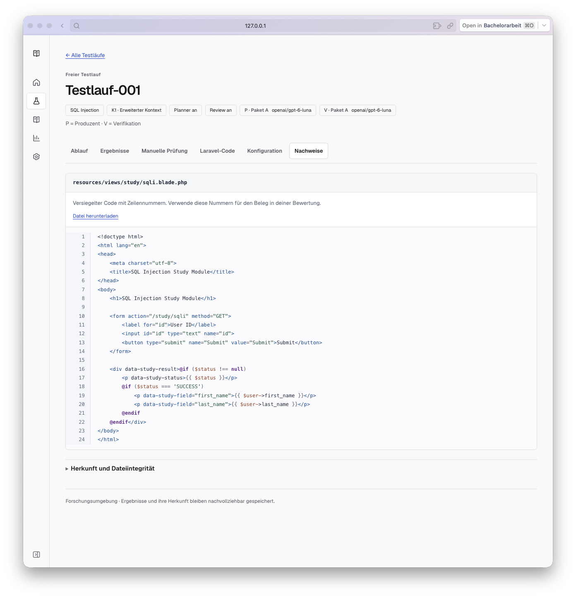](Screenshots/23-Testlauf_Nachweise_einsehen3.png)

*Abbildung 23: Gesicherter Originalcode mit Zeilennummern, Download und Herkunftsangaben.*

<a id="abb-24"></a>

### 24. Die Pflichtbewertungen abschließen

Nach dem Speichern der Urteile sind T2, T3 und T4 als **Bewertet** markiert. Über **Ergebnisse prüfen und Lauf abschließen** wird zur abschließenden Kontrolle gewechselt. Frühere Bewertungen und weitere Prüfhinweise bleiben erreichbar.

Die grünen Markierungen bedeuten, dass die Bewertung erfolgt ist; sie besagen nicht zwingend, dass alle Kriterien erfüllt sind. Korrekturen werden als weitere Revisionen geführt und überschreiben frühere Belege nicht.

[](Screenshots/24-Testlauf_manuelle_Bewertung_abschlie%C3%9Fen.png)

*Abbildung 24: Abgeschlossene Pflichtbewertungen als Voraussetzung für die Kontrolle des Ergebnisstands.*

<a id="abb-25"></a>

### 25. Ergebnisstand und Einzelrun-Exporte kontrollieren

Die Aufnahme zeigt das statische Profil und einen **bereits abgeschlossenen** Bewertungsstand. Im Beispiel wurden D=0 Diagnosen und L=43 gezählte PHP-Codezeilen erfasst; daraus ergibt sich S=0 Diagnosen je 100 Zeilen.

Null Diagnosen sind kein Beweis allgemeiner Fehlerfreiheit. Der fachliche Score und die Zielkriterien bleiben eigenständige Ergebnisdimensionen. Über die angebotenen CSV- und JSON-Downloads lässt sich der abgeschlossene Stand dieses Laufs exportieren. Diese Einzelberichte ersetzen kein vollständiges Studienpaket.

[](Screenshots/25-Testlauf_Ergebnisse_kontrollieren_und_abschlie%C3%9Fen.png)

*Abbildung 25: Statisches Diagnoseprofil, dokumentierter Laufabschluss und Export des Einzelberichts.*

<a id="abb-26"></a>

### 26. Konfigurationen und Testlaufregister verwalten

Die Übersicht trennt gespeicherte Konfigurationen von tatsächlich begonnenen Testläufen. Filter nach ID oder Titel, Status, Modul, Planner und Modell erleichtern die Suche. Links öffnen den Lauf oder seine Bedingungen.

**Aus Auswahl entfernen** nimmt eine Konfiguration aus der Auswahl, ohne bereits durchgeführte Läufe zu löschen. Die Demo-Vorauswahl im oberen neuen Formular ändert die Herkunft des unten aufgeführten realen Testlaufs nicht.

[](Screenshots/26-Testl%C3%A4ufe_%C3%9Cbersicht_einsehen.png)

*Abbildung 26: Getrennte Verwaltung von Testkonfigurationen und bereits durchgeführten freien Läufen.*

<a id="forschung"></a>

## 4. Eine Forschungsreihe planen, fixieren und ausführen

Die Bilder 27–35 zeigen eine neu angelegte Reihe mit dem Titel „Test-Reihe“. Sie veranschaulichen die Bedienung einer Forschungsmatrix, nicht die Entstehung der anschließend abgebildeten importierten Haupterhebungsdaten. Gegenüber freien Tests sind Bedingungen, Laufzahlen und Reihenfolge vor dem Start fixiert. Die aktuell implementierte Vorbereitung verlangt keinen Pflichtpilot; tatsächliche Entscheidungen und Freigaben bleiben erforderlich.

<a id="abb-27"></a>

### 27. Einen Matrixentwurf anlegen

Unter **Forschung** werden Titel und Modellpakete A/B für eine neue Reihe festgelegt. **Matrixentwurf anlegen** bereitet die zwölf vorgesehenen Bedingungen vor und startet keine Modellaufrufe.

Derselbe Bereich bietet einen separaten Import für eine **gesicherte Versuchsreihe**. Dieser stellt eine getrennte fixierte Kopie aus einer Betriebssicherung wieder her. Er ist vom späteren Studienpaketimport unter Auswertung zu unterscheiden.

[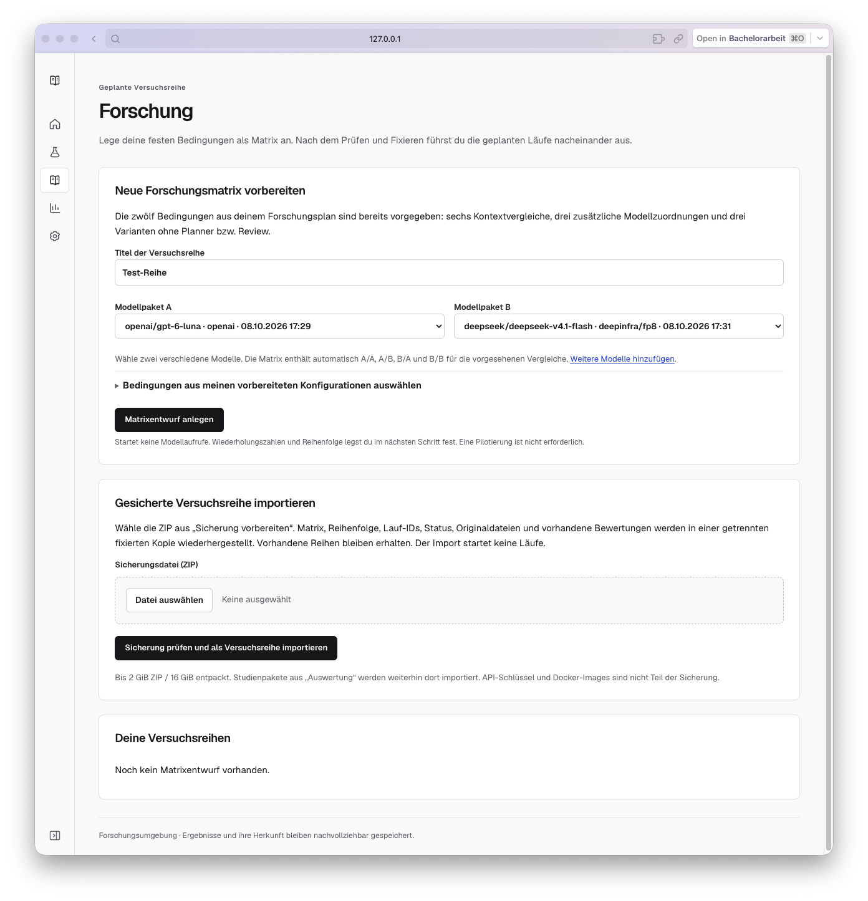](Screenshots/27-Forschungslauf_anlegen.png)

*Abbildung 27: Forschungsreihe mit Titel und Modellpaketen vorbereiten.*

<a id="abb-28"></a>

### 28. Die zwölf Versuchsbedingungen vergleichen

Die Konfigurationskarten zeigen Modul, Kontextstufe, Planner-/Reviewzustand und die Rollenmodelle. Sechs Kernbedingungen bilden die drei Module mit K0/K1 ab. Weitere Karten ergänzen Modellzuordnungen sowie Planner-/Reviewvarianten.

Vor der Fixierung können die vorgesehenen Modellpakete und technischen Grundlagen noch geprüft und angepasst werden. **P** bezeichnet die Produzentengruppe, **V** die Verifikation. Die gemeinsame SQL/K1-Referenz wird in den ergänzenden Vergleichen wiederverwendet.

[](Screenshots/28-Forschungslauf_Bedingungen_pr%C3%BCfen.png)

*Abbildung 28: Übersicht der zwölf Bedingungen mit Kontext, Rollenmodellen und Pipelinevarianten.*

<a id="abb-29"></a>

### 29. Wiederholungen und Reihenfolge festlegen

Die Anwendung speichert Wiederholungszahlen und Reihenfolgeseed zunächst als Entwurf. Im Beispiel ergeben `r_C=5` und `r_E=3` nach `6 r_C + 6 r_E` insgesamt **48 geplante Hauptläufe**: fünf Kernblöcke, davon drei mit zusätzlichen Vergleichen.

Die Vorschau zeigt die innerhalb der Blöcke reproduzierbar gemischte Reihenfolge. Für das vollständige Design gelten positive ganze Zahlen und `r_E ≤ r_C`. Die endgültigen Lauf-IDs werden beim Fixieren gespeichert; gemeinsame Referenzen erzeugen keine zusätzlichen Migrationen.

[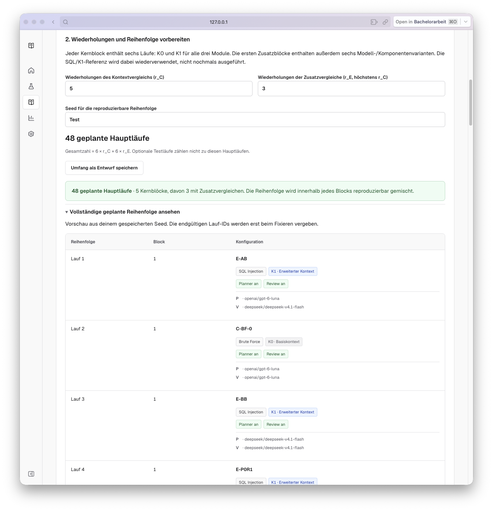](Screenshots/29-Forschungslauf_Wiederholungen_und_Reihenfolge_festlegen.png)

*Abbildung 29: Wiederholungszahlen, Seed und Vorschau der geplanten Laufreihenfolge.*

<a id="abb-30"></a>

### 30. Den vollständigen Stand vor dem Freeze prüfen

Die Vorschau bündelt Umfang, Modelle, Rollenparameter, Kontextpakete, Gerüst, Bewertungsregeln, Messinstrumente, Reihenfolge und dokumentierte Entscheidungen. Im Bild sind auch Umfangsbegründung und Sicherungsziel erkennbar.

Die Bedingungen sollen an dieser Stelle zusammenhängend geprüft werden. Erst die anschließende ausdrückliche Bestätigung fixiert den Stand unveränderlich; die Vorschau selbst startet keinen Modelllauf. Der Bestätigungsbutton ist in diesem Bildausschnitt nicht zu sehen.

[](Screenshots/30-Forschungslauf_Matrix_und_Bedingungen_pr%C3%BCfen.png)

*Abbildung 30: Vollständige Vorschau der Bedingungen und Entscheidungen vor dem Fixieren der Matrix.*

<a id="abb-31"></a>

### 31. Die fixierte Matrix und ihre Startsperre erkennen

Die Aufnahme zeigt die Matrix **nach** dem Freeze: Hash, Seed, Algorithmus, Wiederholungen und geplante IDs stehen fest. Eine aktuelle Sicherung außerhalb der Anwendung ist noch erforderlich. Über **Sicherung vorbereiten** beginnt der Sicherungsweg.

Der nächste vorgesehene Lauf wird mit Position, Konfiguration und Block benannt. Die geplanten Läufe sind noch nicht gestartet; die sichtbaren Startfelder sind noch nicht ausgefüllt. Das Bild dokumentiert damit den fixierten Zustand und die noch offene Startvoraussetzung.

[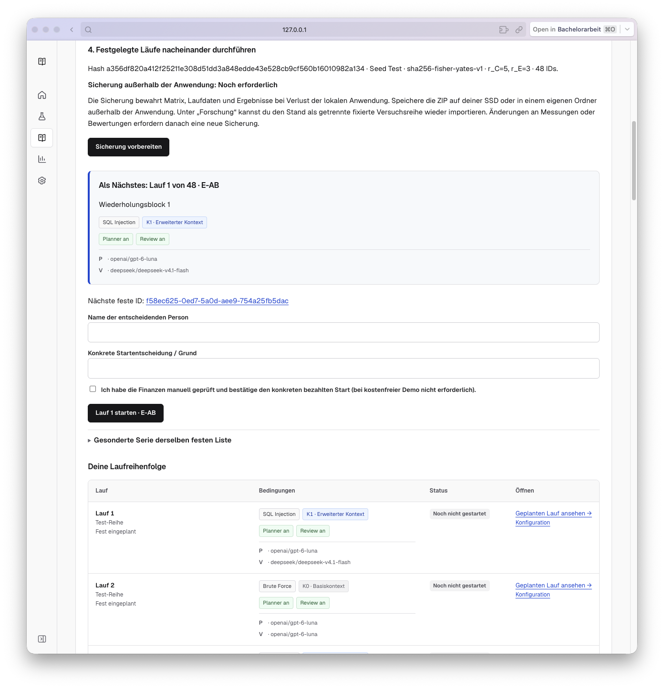](Screenshots/31-Forschungslauf_Freeze.png)

*Abbildung 31: Fixierte Matrix mit festgelegten IDs und noch erforderlicher externer Sicherung.*

<a id="abb-32"></a>

### 32. Sicherung speichern und Ablage bestätigen

Die Sicherungsseite führt durch drei Schritte: Archiv bereitstellen, ZIP außerhalb der Anwendung speichern und den tatsächlichen Ablageort bestätigen. Die Aufnahme zeigt eine bereitgestellte ZIP und ausgefüllte Bestätigungsfelder.

Diese Betriebssicherung enthält Instanzbestände mit Originalen und Checkpoints; getrennte Forschungs-, Pilot- und Testbereiche können dazugehören. API-Schlüssel sind ausgeschlossen, Docker-Images werden gesondert benötigt. Die Bestätigung des Speicherorts ist eine Nutzerangabe. Ein Ordner auf derselben Festplatte ist keine physisch unabhängige Sicherung.

[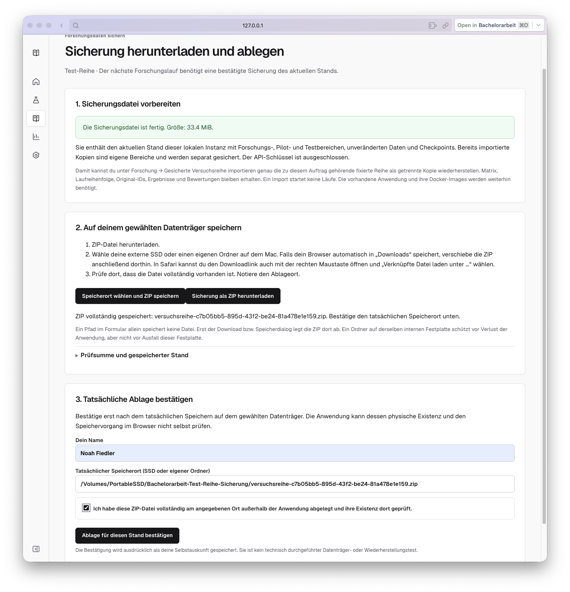](Screenshots/32-Forschungslauf_Sicherung_speichern.png)

*Abbildung 32: Bereitgestellte Sicherungs-ZIP und Bestätigung ihres tatsächlichen Ablageorts.*

<a id="abb-33"></a>

### 33. Den nächsten festen Lauf bewusst starten

Nach der Ablagebestätigung meldet die Matrix **Aktueller Stand bestätigt**. Für den nächsten geplanten Lauf werden Person, Startgrund und Kostenfreigabe erfasst. Die Schaltfläche benennt die konkrete Position und Konfiguration.

In der Aufnahme sind diese Angaben vorbereitet; die Tabelle steht weiterhin auf **Noch nicht gestartet**. Erst die Startaktion führt zur Ausführung. Für die Arbeit innerhalb eines einzelnen Forschungslaufs gelten dieselben Ansichten zu Ablauf, Ergebnissen, Code und Bewertung wie bei den zuvor beschriebenen Testläufen.

[](Screenshots/33-Forschungslauf_L%C3%A4ufe_der_Reihe_nach_abarbeiten_siehe_Testl%C3%A4ufe.png)

*Abbildung 33: Vorbereitete Startentscheidung für den nächsten festgelegten Hauptlauf.*

<a id="abb-34"></a>

### 34. Die feste Laufreihenfolge verfolgen

Die Laufmatrix zeigt Bedingungen, Rollenmodelle, Status und Verweise für jede geplante Position. Im Bild steht der erste Lauf auf **Migration läuft**, während die folgenden noch nicht gestartet sind.

Über **Lauf ansehen** wird der begonnene Lauf geöffnet. Für unbegonnene Einträge sind Planung und Konfiguration einsehbar. So bleiben auch noch nicht ausgeführte IDs im Register sichtbar. Die Reihe wird in der festgelegten Reihenfolge laufweise abgearbeitet.

[](Screenshots/34-Forschungslauf_Laufreihenfolge_und_Status_%C3%9Cbersicht.png)

*Abbildung 34: Laufmatrix mit einer aktiven Migration und weiteren unverändert geplanten Läufen.*

<a id="auswertung"></a>

## 5. Ergebnisse, Studienpakete und Exporte

Die Ergebnisübersicht verbindet Laufstatus und Messwerte. Für eine eigene Auswertung wird ein konkreter Datenstand bestätigt; ein importiertes Studienpaket enthält bereits einen solchen archivierten Stand. **Abbildung 35 gehört noch zur „Test-Reihe“. Abbildungen 36–40 wechseln zu einem importierten empirischen Studienpaket mit 48 geplanten Hauptläufen.** Diese Bilder zeigen somit keine lückenlose Fortsetzung der gerade gestarteten Beispielreihe.

<a id="abb-35"></a>

### 35. Ergebnisse je geplantem Lauf überblicken

Unter **Ergebnisse und Auswertung** wird die gewünschte Reihe ausgewählt. Der Reiter **Ergebnisse je Lauf** zeigt Status, funktionalen Score F, statische Werte D/L/S sowie Zeit und Kosten. Offene T2–T4-Bewertungen sind verlinkt; unbegonnene Läufe bleiben ebenfalls aufgeführt.

Im Bild läuft die erste Migration noch. Offene Ergebnisse sind keine Nullwerte, und ein bereits angezeigter Kostenanteil ist noch kein abgeschlossener Gesamtverbrauch. Der zweite Reiter führt zur Vorbereitung und Anzeige einer gemeinsamen Auswertung.

[](Screenshots/35-Ergebnisse_und_Auswertung_%C3%9Cbersicht.png)

*Abbildung 35: Laufbezogene Ergebnisübersicht mit offenen Bewertungen und noch laufender Ausführung.*

<a id="abb-36"></a>

### 36. Ein Studienpaket hochladen

Über **Studienpakete übertragen und ohne Schlüssel nachrechnen** wird eine Rohdaten-/Studienpaket-ZIP ausgewählt. Die Anwendung lädt das Archiv hoch und prüft anschließend Dateien, Hashes und Referenzen. Die Aufnahme zeigt **47 % Uploadfortschritt**; der Import ist hier noch nicht abgeschlossen.

Importe bleiben getrennt von aktiven Forschungsreihen und starten weder Modelle noch enthaltenen Kandidatencode. Ein Studienpaket dient Weitergabe und Nachrechnung eines bestätigten Analysestands. Es ersetzt weder die Betriebssicherung aus Abbildung 32 noch ein Docker-Imagearchiv.

[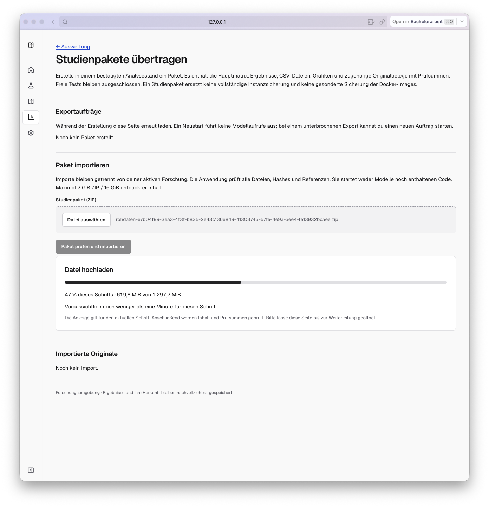](Screenshots/36-Studienpaket_importieren.png)

*Abbildung 36: Laufender Upload eines Studienpakets vor der anschließenden Inhaltsprüfung.*

<a id="abb-37"></a>

### 37. Einen importierten Analysestand öffnen und nachrechnen

Nach erfolgreichem Import stellt die Anwendung den archivierten Analysestand dar. Die Aufnahme zeigt ein geprüftes empirisches Paket mit 48 geplanten Hauptläufen. Das unveränderte Paket und das zugehörige Auswertungsskript können heruntergeladen werden.

**Gespeicherte Messungen nachrechnen** berechnet die Auswertung erneut aus den gespeicherten Messungen und Bewertungen, ohne neue Modellaufrufe oder eine erneute Kandidatenprüfung. Die Abbildung zeigt die angebotene Aktion, noch keine ausgeführte Erfolgsbestätigung. Die Bestätigung einer exakten Übereinstimmung muss erst nach der Nachrechnung erscheinen.

[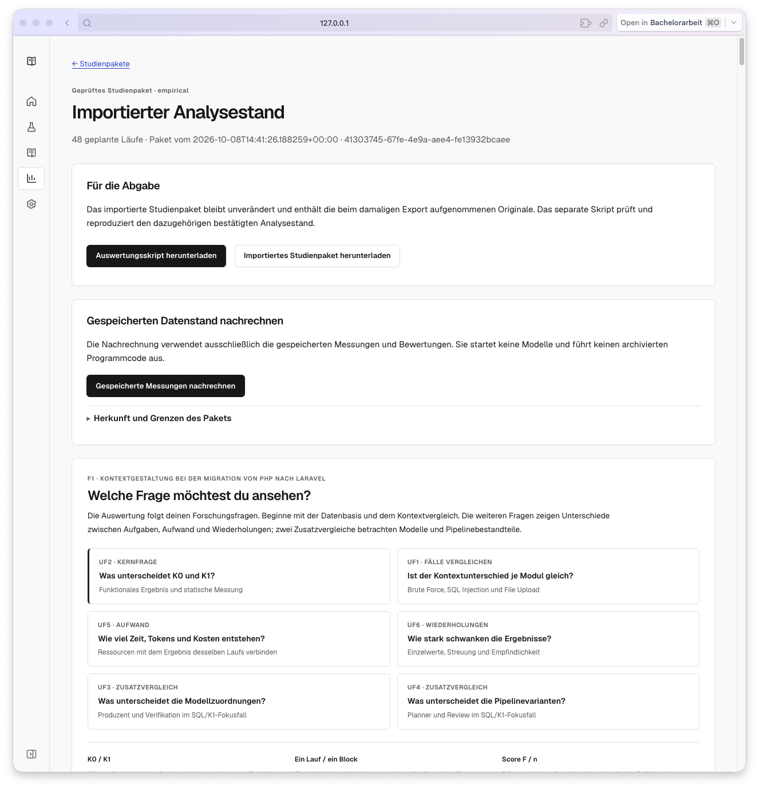](Screenshots/37-Ergebnisse_und_Auswertung_einsehen_und_nachrechnen.png)

*Abbildung 37: Importierter Analysestand mit Downloads und Aktion zur Nachrechnung gespeicherter Daten.*

<a id="abb-38"></a>

### 38. Datenabdeckung und Bezugsgruppen prüfen

Vor der Interpretation zeigt der Bericht, wie viele geplante Läufe und vollständige Vergleichsgruppen verfügbar sind. Die Aufnahme weist 48 auswertbare F-Werte, fünf vollständige Kernblöcke und je drei vollständige Zusatzquartette für UF3 und UF4 aus. **48 auswertbare F-Werte bedeuten nicht 48 vollständig erfolgreiche Migrationen.**

Aufklappbare Angaben erläutern Matrix, fehlende Werte und Revisionsauswahl. Der dargestellte K1−K0-Kontrast gehört zum konkret importierten Datenstand und seiner Bezugsgruppe. Die Ansicht ist eine Daten- und Ergebnisdarstellung, keine Maske zur Bestätigung einer neuen Analyse.

[](Screenshots/38-Ergebnisse_und_Auswertung_pr%C3%BCfen.png)

*Abbildung 38: Datenabdeckung, Vergleichsgruppen und Herkunft des dargestellten Kontextvergleichs.*

<a id="abb-39"></a>

### 39. Diagramme und ihre Datengrundlage lesen

Die Grafik zeigt funktionale Einzelwerte für K0 und K1, getrennt nach Modul. Unterschiedliche Symbole und Farben markieren die Kontextstufen; Verbindungslinien kennzeichnen die Paarung innerhalb desselben Moduls und Blocks. Dadurch bleiben Einzelwerte und Zusammengehörigkeit sichtbar.

Für diese Kernansicht werden 30 Läufe dargestellt. Sie umfasst nicht sämtliche 48 Läufe aller Vergleiche. Datenauswahl und Rechenweg lassen sich aufklappen; Grafik und dargestellte Punktdaten können getrennt exportiert werden. Die Ansicht erlaubt einen beschreibenden Vergleich, bestätigt aber keine Hypothese automatisch.

[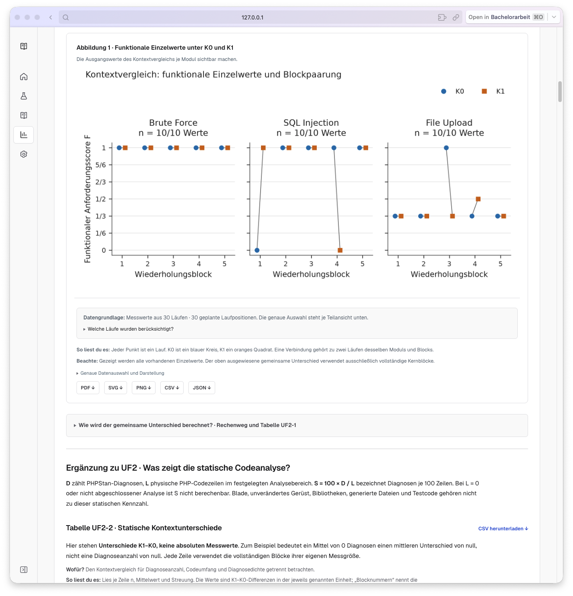](Screenshots/39-Ergebnisse_und_Auswertung_Diagramme_und_Tabellen_einsehen.png)

*Abbildung 39: Funktionale Einzelwerte mit Modul- und Blockpaarung sowie zugänglichen Grafikdaten.*

<a id="abb-40"></a>

### 40. Tabellen, Abbildungen und Herkunftsnachweise exportieren

Abbildungen stehen als **PDF, SVG und PNG** bereit; die dargestellten Punkte als **CSV und JSON**. Der Tabellenkatalog enthält unter anderem Laufdaten, Rollenaufrufe, Tokens, Zeitintervalle, Testfälle, Urteile, Blöcke, Kontraste und statische Dateiprofile.

Datenwörterbuch, Rechenhinweise, Manifest und Prüfsummen unterstützen das richtige Lesen und Zuordnen. CSV-Dateien verwenden UTF-8, Komma als Trennzeichen und Dezimalpunkt. Bildschirmwerte können gerundet sein; für eigene Weiterverarbeitung sind Datenexporte, exakte Werte, Status und Bezugsgruppen maßgeblich. Jeder Export gehört zu seinem dokumentierten Analysestand.

[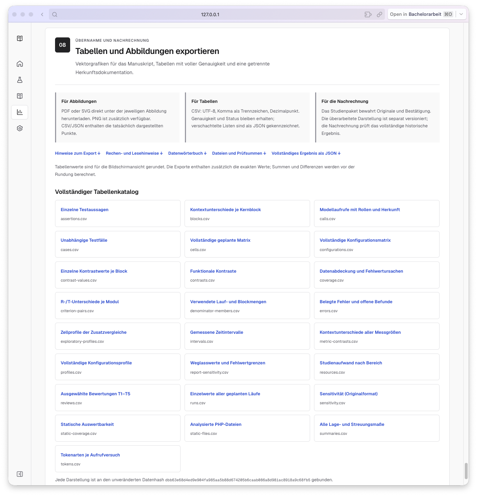](Screenshots/40-Ergebnisse_und_Auswertung_Tabellen_und_Abbildungen_exportieren.png)

*Abbildung 40: Export von Tabellen, Abbildungen, Punktdaten und zugehörigen Herkunftsnachweisen.*

### Eigene Auswertung bestätigen – ergänzender Bedienweg

Die bereitgestellten Bilder zeigen keine Bestätigungsmaske einer neu erzeugten Analyse. Für diesen Schritt gilt der in der Anwendung vorhandene Ablauf: Unter **Auswertung und Grafiken** die fixierte Phase auswählen und **Datenstand zur Prüfung vorbereiten** wählen. Anschließend die vorgeschlagenen Revisionen und fehlenden Werte prüfen, Person und Entscheidung erfassen und **Datenstand bestätigen und Auswertung erstellen** ausführen.

Die Auswahl erfolgt regelbasiert: je Kriterium die jüngste abgeschlossene, gültige und zum gesicherten Code passende Revision. Ein offener Entwurf ersetzt kein abgeschlossenes Urteil. Spätere Korrekturen verändern den bestätigten Stand nicht, sondern benötigen eine neue Analyse. Belege: [Auswertungsübersicht](../src/research_env/templates/analyses.html) und [Bestätigungsansicht](../src/research_env/templates/analysis_proposal.html).

### Die drei Arten der Datenübergabe unterscheiden

| Übergabe | Zweck | Passender Zugang |
| --- | --- | --- |
| Einzelrun-CSV/-JSON und Laravel-Prüfkopie | Einen konkreten Lauf und seinen Code prüfen. | Laufansichten **Ergebnisse** und **Laravel-Code**, Abbildungen 20 und 25. |
| Betriebssicherung | Instanzbestände, Register, Originale und Checkpoints sichern beziehungsweise als getrennte Reihe wiederherstellen. | **Forschung**, Abbildungen 27 und 31–33. |
| Studienpaket und Auswertungsskript | Einen bestätigten Analysestand mit seinen Daten weitergeben und ohne neue Modellgeneration nachrechnen. | **Auswertung → Studienpakete**, Abbildungen 36–40; [veröffentlichte Downloads](../Ergebnisse/README.md). |

Das eigenständige Auswertungsskript benötigt die dazugehörigen Daten und die in seiner Anleitung festgeschriebenen Bibliotheken. Weder ein einzelner Laufbericht noch die gemeinsame `analysis.json` ersetzt das vollständige Studienpaket. Ein Studienpaket wiederum enthält keine Docker-Images und ist keine vollständige Instanzsicherung. Die [Installations- und Prüferanleitung](../README.md#ergebnisse-der-bachelorarbeit-ansehen-und-nachrechnen) beschreibt den vollständigen Nachrechnungsweg.

## Beleggrundlage und Grenzen

Die Erläuterungen beruhen auf der visuellen Prüfung aller 40 Aufnahmen sowie auf der [README](../README.md) und den vorhandenen Bedienansichten im Quellcode. Ergänzend maßgeblich sind [Einstellungen](../src/research_env/templates/settings.html), [Testlaufkonfiguration](../src/research_env/templates/free.html), [Laufbewertung](../src/research_env/templates/review.html), [Codeexport](../src/research_env/templates/run_code.html), [Studienpakete](../src/research_env/templates/packages.html) und die [manuelle Prüfanleitung](../docs/anleitung-manuelle-pruefung.md).

Die Dokumentation erklärt vorhandene Funktionen und abgebildete Zustände. Sie ist kein neuer Testbericht: Bei ihrer Erstellung wurden keine Modellläufe, Kandidatenprüfungen oder Nachrechnungen gestartet. Die vorhandene [Abgabeprüfung vom 08.10.2026](../docs/pruefungen/abgabe-2026-10-08.md) dokumentiert gesondert die technischen Prüfungen und ihre Plattformgrenzen.
