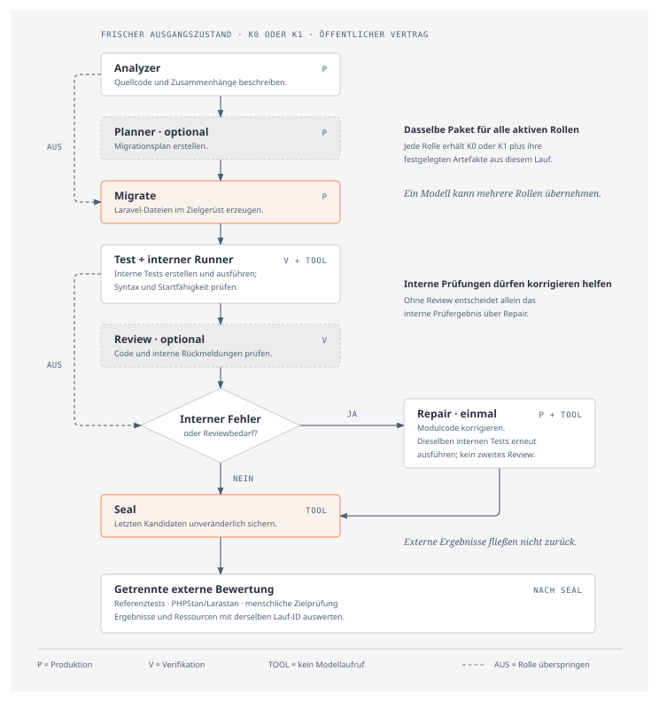

# KI-gestützte Migration von PHP nach Laravel – Forschungsumgebung

Diese lokale Anwendung untersucht die Migration der DVWA-Module **Brute Force (BF), SQL Injection (SQL) und File Upload (UP)**. Sie führt die konfigurierten Agentenrollen aus, sichert sämtliche Laufartefakte und bewertet den versiegelten Laravel-Code unabhängig. Eine Versuchsreihe liefert Einzelwerte, beschreibende Vergleiche, CSV-Tabellen und Abbildungen.

**Die Anwendung kennenlernen:** Die [bebilderte Funktionsdokumentation](Dokumentation/Anwendungsdokumentation.md) erklärt Einrichtung, Modelle und Kontextpakete, freie Testläufe, Forschungsreihen, Bewertung und Auswertung anhand von 40 Screenshots mit Erläuterungen und Bildunterschriften.

Die Ausgangsmodule stammen aus [DVWA (Damn Vulnerable Web Application)](https://github.com/digininja/DVWA), einer bewusst verwundbaren PHP-Lernanwendung. Verwendet wird der festgehaltene [Commit `b496a5d3de6b967410155e1b7d3e51e9d035eb22`](https://github.com/digininja/DVWA/commit/b496a5d3de6b967410155e1b7d3e51e9d035eb22): [Brute Force](https://github.com/digininja/DVWA/blob/b496a5d3de6b967410155e1b7d3e51e9d035eb22/vulnerabilities/brute/source/low.php), [SQL Injection](https://github.com/digininja/DVWA/blob/b496a5d3de6b967410155e1b7d3e51e9d035eb22/vulnerabilities/sqli/source/low.php) und [File Upload](https://github.com/digininja/DVWA/blob/b496a5d3de6b967410155e1b7d3e51e9d035eb22/vulnerabilities/upload/source/low.php), jeweils `source/low.php`. Herkunft und Prüfsummen stehen in den Manifesten der [mitgelieferten Kontextpakete](assets/context/m2-v0.1-csrf1). Eine separate DVWA-Installation ist zum Ausprobieren dieser Forschungsumgebung nicht erforderlich.

**Für die Prüfung der Bachelorarbeit:** [Ergebnisdateien und Downloadübersicht](Ergebnisse/README.md) → bei Bedarf [Anwendung installieren](#installieren-und-starten) → [Rohdatenpaket importieren und exakt nachrechnen](#ergebnisse-der-bachelorarbeit-ansehen-und-nachrechnen). Dafür sind **kein API-Schlüssel und keine neuen Modellläufe** erforderlich. Die Berichte aller 48 Hauptläufe, die gemeinsame Lauftabelle und das Auswertungsskript liegen im Ordner [Ergebnisse](Ergebnisse/README.md). Die umfangreichen Originalarchive stehen im [Release „abgabe-2026-10-08“ desselben Repositories](https://github.com/nofiedler/Bachelorarbeit-Forschungsumgebung-Public/releases/tag/abgabe-2026-10-08).

**Git-Clone und „Code → Download ZIP“ enthalten die versionierten Ergebnisdateien und das Skript, aber keine Release-Archive.** Für den Import das Rohdaten-Studienpaket zusätzlich über die [Downloadübersicht](Ergebnisse/README.md#dateien-und-archive) herunterladen.

**Technischer Prüfstand:** [Abgabeprüfung vom 08.10.2026](docs/pruefungen/abgabe-2026-10-08.md). Frühere Prüfungen: [06.10.2026](docs/pruefungen/research-audit-2026-10-06/README.md), [07.10.2026](docs/pruefungen/ui-matrix-2026-10-06/README.md#veröffentlichungsprüfung-vom-07102026).

## Installieren und starten

### Voraussetzungen

| Werkzeug | Wofür und woher? |
| --- | --- |
| [Git](https://git-scm.com/install/) | Lädt dieses Repository. Unter Windows Git innerhalb der unten beschriebenen Ubuntu-/WSL2-Umgebung installieren. |
| POSIX-Shell | Führt `start.sh` aus: unter macOS/Linux das normale Terminal, unter Windows die Linux-Shell von [WSL2](https://learn.microsoft.com/en-us/windows/wsl/install). |
| Docker mit Linux-Containern | Führt Anwendung, Datenbank und Prüfwerkzeuge aus. [Docker Desktop für macOS](https://docs.docker.com/desktop/setup/install/mac-install/) oder [Windows](https://docs.docker.com/desktop/setup/install/windows-install/) installieren und starten; unter Linux ist auch [Docker Engine](https://docs.docker.com/engine/install/) möglich. |
| [Docker Compose](https://docs.docker.com/compose/install/) | Startet die zusammengehörigen Dienste. In Docker Desktop bereits enthalten; bei Docker Engine unter Linux das [Compose-Plugin](https://docs.docker.com/compose/install/linux/) ergänzen. Verwendet wird der Befehl `docker compose`. |

<details>
<summary>Windows: Ubuntu/WSL2 einmalig vorbereiten</summary>

1. PowerShell **als Administrator** öffnen und `wsl --install -d Ubuntu` ausführen. Falls Windows dazu auffordert, neu starten. Mit `wsl -l -v` prüfen, dass Ubuntu unter Version **2** läuft; eine vorhandene Version 1 lässt sich mit `wsl --set-version Ubuntu 2` umstellen ([Microsoft-Anleitung](https://learn.microsoft.com/en-us/windows/wsl/install)).
2. **Ubuntu** im Startmenü öffnen oder `wsl -d Ubuntu` in PowerShell eingeben. Beim ersten Start Linux-Benutzername und Passwort einrichten. Falls Git fehlt, in dieser Ubuntu-Shell `sudo apt update` und anschließend `sudo apt install git` ausführen ([Git für Linux](https://git-scm.com/install/linux)).
3. Docker Desktop installieren und starten. Den WSL2-Unterbau verwenden: falls angezeigt, **Settings → General → Use WSL 2 based engine** aktivieren. Unter **Settings → Resources → WSL Integration** Ubuntu einschalten und übernehmen. Fehlt die WSL-Integration, im Docker-Menü **Switch to Linux containers** wählen ([Docker-Anleitung für WSL2](https://docs.docker.com/desktop/features/wsl/)).
4. Die folgenden Projektbefehle in der **Ubuntu-Shell** ausführen. Mit `cd ~` zunächst in das Linux-Benutzerverzeichnis wechseln und das Repository dort klonen.

</details>

Unter **macOS** benötigt der Worker `/var/run/docker.sock`. Fehlt dieser Socket, in Docker Desktop unter **Settings → Advanced → Allow the default Docker socket to be used** einschalten ([Docker-Einstellungen](https://docs.docker.com/desktop/settings-and-maintenance/settings/#advanced-mac-only)).

Vor dem Klonen kurz prüfen:

```sh
git --version
docker info --format '{{.OSType}}'
docker compose version
```

Der mittlere Befehl muss `linux` ausgeben; die beiden anderen müssen eine Versionsnummer melden.

### Repository laden und Anwendung starten

Python, PHP, Composer und Node müssen nicht auf dem Host installiert sein. Beim ersten Bau ist Internet für öffentliche Paket- und Imageregistries erforderlich. Der erste Bau dauert mehrere Minuten; Images brauchen zusätzlichen lokalen Speicher, gehören aber nicht in den Git-Clone.

Repository klonen und in den Ordner wechseln:

```sh
git clone https://github.com/nofiedler/Bachelorarbeit-Forschungsumgebung-Public.git
cd Bachelorarbeit-Forschungsumgebung-Public
```

Dann **einen Befehl** ausführen:

```sh
./start.sh
```

Dann **http://127.0.0.1:8000** öffnen. Das Skript baut die festgeschriebenen Python-/PHP-/Sandbox-Grundlagen, lädt MySQL, registriert die tatsächlich gebauten unveränderlichen Image-IDs und startet Weboberfläche und Worker. Es startet keine Modellaufrufe. Die kostenlose Demo und das Nachrechnen eines passenden Studienpakets brauchen keinen API-Schlüssel.

Ist Port 8000 belegt, zum Beispiel `RESEARCH_PORT=8162 ./start.sh` verwenden. Für getrennte Installationen zusätzlich einen eigenen `COMPOSE_PROJECT_NAME` setzen und denselben Wert bei späteren Befehlen beibehalten. Auf Linux muss der Worker die Gruppe des Docker-Sockets erhalten, gegebenenfalls mit `RESEARCH_DOCKER_SOCKET_GID=$(stat -c %g /var/run/docker.sock) ./start.sh`. Primär geprüft ist macOS/ARM64 mit Docker Desktop; der Betrieb unter Windows/WSL2 und auf AMD64-Prüferrechnern ist noch gesondert zu prüfen.

Die Oberfläche ist ausschließlich an die lokale Loopback-Adresse gebunden. Der vertrauenswürdige Worker benötigt Zugriff auf Docker. Kandidatencode läuft in getrennten Containern ohne Hostpfade, Docker-Socket, API-Schlüssel oder Zugriff auf das Bewertungssystem.

## Ergebnisse der Bachelorarbeit ansehen und nachrechnen

Eine frische Anwendung hat noch keine importierten Forschungsdaten; die Dateien im Repository werden nicht automatisch in die Anwendung geladen. Zuerst das [Rohdaten-Studienpaket als ZIP herunterladen](https://github.com/nofiedler/Bachelorarbeit-Forschungsumgebung-Public/releases/download/abgabe-2026-10-08/rohdaten-e7b04f99-3ea3-4f3f-b835-2e43c136e849-41303745-67fe-4e9a-aee4-fe13932bcaee.zip). Es gehört zum bestätigten Analysestand `e7b04f99-3ea3-4f3f-b835-2e43c136e849` der **Bachelorarbeit-Haupterhebung**. Die ZIP für den Import **nicht entpacken**. Dieser Weg genügt zum Ansehen und Nachrechnen; die weiteren Archive sind ergänzende Originalsammlungen.

1. Die Anwendung unter **http://127.0.0.1:8000** öffnen.
2. Unter **Auswertung** den Link **Studienpakete übertragen und ohne Schlüssel nachrechnen** öffnen, unter **Paket importieren** die Rohdaten-ZIP auswählen und **Paket prüfen und importieren** anklicken. Direkter Einstieg: **http://127.0.0.1:8000/packages**. Der Fortschritt zeigt die aktuelle Importphase; bei großen Archiven kann die Prüfung mehrere Minuten dauern.
3. Im **Importierten Analysestand** die Datenbasis und anschließend die Abschnitte UF2, UF1, UF5, UF6, UF3 und UF4 ansehen. Die Tabellen und Diagramme werden aus dem unveränderten bestätigten Analysestand mit der installierten Darstellungsfassung angezeigt. Die historischen Originalausgaben bleiben zusätzlich erhalten. Über „Verwendete Läufe“ bzw. die aufklappbaren Herkunftsangaben lassen sich die konkreten Daten jedes Vergleichs nachvollziehen.
4. **Gespeicherte Messungen nachrechnen** anklicken. Bei Erfolg erscheint **„Nachrechnung stimmt exakt mit dem bestätigten Ergebnis überein.“** Die Anwendung berechnet die Auswertung erneut aus der gespeicherten Datenauswahl; sie erzeugt keine neuen Messungen und führt keine Modelle aus.
5. Tabellen über **CSV**, Abbildungen über **PDF, SVG oder PNG** und deren zugrunde liegende Punktdaten über **CSV/JSON** herunterladen. Am Ende der Ansicht lassen sich die einzelnen Läufe mit ihren Messwerten, Bewertungen und Pipeline-Schritten aufklappen.

Das Paket bleibt getrennt von eigenen Forschungsreihen. Import und Nachrechnung ändern weder die übergebenen Originale noch deren bestätigte Bewertungsstände. Für diesen Prüferweg ist „Grundausstattung vorbereiten“ nicht nötig. **Forschung → Gesicherte Versuchsreihe importieren** ist ein anderer Import für Betriebssicherungen, nicht für das hier beschriebene Rohdaten-/Studienpaket.

### Die gesammelten Daten direkt als Datei ansehen

Ohne Installation lassen sich die [gemeinsame Lauftabelle](Ergebnisse/Auswertung/runs.csv), ihr [Datenwörterbuch](Ergebnisse/Auswertung/data-dictionary.json), die [Methodenbeschreibung](Ergebnisse/Auswertung/methods.md) und die [CSV-/JSON-Berichte je Lauf](Ergebnisse/Einzellaeufe) direkt herunterladen. Der Ordner [Auswertung](Ergebnisse/Auswertung) enthält den vollständigen, unveränderten Bereich `presentation/` des Rohdatenpakets mit Tabellen, Diagrammen, Methodenerläuterungen und Herkunftsnachweisen. Die [Laufzuordnung](Ergebnisse/laufzuordnung.csv) verbindet die Ordner Lauf01 bis Lauf48 mit geplanten und tatsächlichen IDs.

Für sämtliche Originaldateien **eine Kopie** der Rohdaten-ZIP entpacken. Das vollständige Paket umfasst mehrere zusammengehörige Dateien; folgende Dateien sammeln die Daten besonders übersichtlich:

| Datei im entpackten Paket | Was sie enthält und wie sie sich öffnen lässt |
| --- | --- |
| **`presentation/runs.csv`** | Die gemeinsame Lauftabelle: eine Zeile je geplanter Lauf-ID mit Konfiguration, Ergebnissen, Zeiten, Tokens, Kosten und Fehlwertstatus. In Excel oder LibreOffice über **Daten → Aus Text/CSV** mit UTF-8, Komma als Trennzeichen und Dezimalpunkt importieren. IDs als Text behandeln. Dies ist der einfachste tabellarische Einstieg. |
| **`analysis/analysis.json`** | Der vollständige bestätigte Analysestand in **einer JSON-Datei**, einschließlich der darin ausgewählten Laufprofile, Messwerte, Bewertungen und berechneten Vergleiche. In einem Text-/Codeeditor öffnen, bei Bedarf JSON formatieren und nach einer Lauf-ID suchen. Diese Datei ist keine alleinige Sammlung sämtlicher Originaldateien oder späterer Revisionen. |
| `analysis/input.json` | Die eingefrorene Eingabe der Nachrechnung: welche Messungen und Bewertungsrevisionen in genau diesen Analysestand eingehen. |
| `registers/records.jsonl` | Alle im Paket enthaltenen unveränderlichen Registerdatensätze, ein JSON-Objekt pro Zeile. In einem Editor mit Unterstützung großer Dateien öffnen oder zeilenweise einlesen. Die Datei kann sehr groß sein; zur Übersicht zuerst `runs.csv` verwenden. |
| `raw-data/README.md`, `raw-data/artifact-index.csv` | Erläuterungen zu den zusätzlichen Rohprotokollen und ein Index, der Originaldateinamen, Lauf-IDs und Prüfsummen den Dateien unter `objects/sha256/` zuordnet. |

Der bestätigte Analysestand ist zusätzlich als [einzelne Datei `analysis.json` im Release](https://github.com/nofiedler/Bachelorarbeit-Forschungsumgebung-Public/releases/download/abgabe-2026-10-08/analysis.json) verfügbar. Diese Datei ersetzt das Rohdatenpaket mit seinen Originalobjekten nicht. Die gemeinsame JSON-Datei lässt sich auch in der Anwendung herunterladen: im importierten Analysestand unten **Historische Originaldateien → Bestätigte Originalausgaben herunterladen → analysis.json** öffnen. In der ursprünglichen eigenen Auswertung heißt der Bereich **Archivierte Ausgaben → Ursprünglich bestätigte Exportdateien**.

**Wichtig beim Lesen:** Leere oder als unvollständig bezeichnete Werte sind keine Nullen. Der bestätigte Analysestand wählt bestimmte abgeschlossene Revisionen aus; das Rohdatenpaket kann zusätzlich später gespeicherte Belege enthalten. Laufnummer, geplante ID und tatsächliche Lauf-ID sind unterschiedliche Kennungen und werden in der gemeinsamen Tabelle zugeordnet. Originaldateien für die Nachrechnung nicht bearbeiten; Formatierungen oder eigene Berechnungen nur in Kopien durchführen.

### Ergänzend: Auswertung ohne Forschungsanwendung nachrechnen

Das [Auswertungsskript im Ergebnisordner](Ergebnisse/Auswertungsskript/README.md) gehört zum selben Analysestand und ist zusätzlich als [unverändertes Skript-ZIP](https://github.com/nofiedler/Bachelorarbeit-Forschungsumgebung-Public/releases/download/abgabe-2026-10-08/auswertungsskript-e7b04f99-3ea3-4f3f-b835-2e43c136e849.zip) erhältlich. Es enthält `auswerten.py`, den gebundenen Rechenkern, die Darstellungsquellen, ein Manifest und eine eigene README. Dies ist ein ergänzender Weg; für die Prüfung in der Anwendung werden weder Python auf dem Host noch dieses separate Skript benötigt.

Für den unabhängigen Weg in `Ergebnisse/Auswertungsskript` wechseln oder das Skript-ZIP entpacken. In diesem Ordner mit **Python 3.13** unter macOS/Linux oder Windows/WSL ausführen:

```sh
python3.13 -m venv .venv
. .venv/bin/activate
python -m pip install --require-hashes -r requirements.lock
python auswerten.py --studienpaket "/Pfad/rohdaten-….zip" --ausgabe "/Pfad/nachrechnung"
```

Die Beispielpfade durch die tatsächlichen Pfade ersetzen. Der Ausgabeordner muss neu sein. Nur die einmalige Bibliotheksinstallation braucht Internet; danach läuft die Nachrechnung ohne Netzwerk, API-Schlüssel oder Anwendungsdatenbank. Sie prüft Dateien und Bindungen, vergleicht das gesamte berechnete Ergebnis mit dem Original und erzeugt Tabellen, Abbildungen sowie **`nachrechnung.json`** als Prüfbericht. Eine Meldung über abweichende Versionen oder Prüfsummen nicht umgehen: das zusammengehörige Paket und Skript verwenden. Das Nachrechnen gespeicherter Daten ist keine erneute Ausführung der ursprünglichen Modell- oder Codeprüfläufe.

## Eigene Forschung oder kostenlose Demo nutzen

Die folgenden Abschnitte sind nur für eigene Läufe erforderlich. Zum Ansehen der abgegebenen Ergebnisse genügt der obige Prüferweg.

### Erstes Ausprobieren ohne Kosten

1. **Einstellungen → Grundausstattung vorbereiten.** Dadurch werden mitgelieferte Paket- und Werkzeugversionen registriert.
2. **Testläufe:** Titel, Modul und Kontextstufe wählen. Für beide Modellpakete „Kostenfreie Demo“ verwenden; Planner und Review nach Wunsch aktivieren. „Konfiguration anlegen“ speichert nur die Bedingungen.
3. Die Zusammenfassung prüfen, den eigenen Namen angeben und **Kostenfreie Demo starten** wählen. Die Demo liefert feste synthetische Antworten mit absichtlich leerem Modulcode. Externe Fälle dürfen deshalb fehlschlagen; L=0 und ein nicht definierter S-Wert sind dabei erwartbar. Die Demo prüft den Bedien- und Datenfluss, nicht die KI-Leistung.
4. **Ablauf** zeigt Rollen, Zeiten, Übergaben und eventuelle Fehler. Ein Neuladen oder Doppelklick erzeugt keinen zusätzlichen Lauf. Nach der Generierung wird der Code versiegelt; anschließend folgen Funktionsprüfung und statische Analyse.
5. Unter **Ergebnisse** den Status prüfen. **Laravel-Code** stellt eine separate ZIP-Prüfkopie mit `START.md` bereit. Unter **Manuelle Prüfung** T2, T3 und T4 anhand der erläuterten Kriterien und Codezeilen beurteilen. Ein offener Entwurf zählt nicht als bestanden.
6. Den vollständigen Bewertungsstand ausdrücklich abschließen. Danach sind Einzelrun-CSV und -JSON verfügbar. Der CSV-Export enthält zuerst Messwerte und anschließend unter `record/…` alle JSON-Einzelwerte samt Konfiguration, Modellen, Fällen, Gründen und IDs.

Die [ausführliche Anleitung zur manuellen Prüfung](docs/anleitung-manuelle-pruefung.md) erklärt für BF, SQL und File Upload die zu öffnenden Dateien, T2–T4, Integrationsbefunde und das Ausfüllen der Belegfelder mit Textvorlagen.

Ein interner Testfehler bedeutet nicht automatisch, dass die Anwendung fachlich falsch ist. Interne Tests sind von der Verifikationsrolle erzeugte Prozessartefakte; der endgültige Funktionsscore stammt ausschließlich aus der unabhängigen Bewertung. Umgekehrt ersetzt eine erfolgreiche Funktionsprüfung keine offene Zielkonformitätsprüfung.

## Reale Modelle und unterschiedliche P-/V-Zuordnungen

Unter **Einstellungen** den OpenRouter-Schlüssel lokal speichern, aktuelle Modellmetadaten laden und für jedes Modell einen festen Provider-Endpunkt auswählen. Der Schlüssel wird getrennt im `secrets`-Volume gespeichert und nicht in Forschungsarchive exportiert. Das Laden der Modellmetadaten ist kein Modelllauf. Reale Läufe verursachen providerabhängige Kosten und benötigen eine bewusste Freigabe.

**A/B sind Modellpakete der Konfiguration**, keine fest eingebauten Modellnamen. Mit A=Modell 1, B=Modell 2 und P=A/V=B arbeitet die Produzentengruppe mit Modell 1 und die Verifikationsgruppe mit Modell 2:

| Gruppe | Rollen |
| --- | --- |
| P – Produzent | Analyzer, optional Planner, Migrate, gegebenenfalls einmal Repair |
| V – Verifikation | Test, optional Review |

Die Reihenfolge lautet Analyzer → optional Planner → Migrate → Test → interner Runner → optional Review → gegebenenfalls **ein** Repair mit erneuter interner Prüfung → Seal. Interne Testdateien bleiben beim Repair unverändert. Modell-/Providerzuordnungen, tatsächliche Antworten, Transportversuche, Usage und Kosten werden je Rollenaufruf gespeichert. Fehlende Usage bleibt fehlend. Es gibt keine anwendungsseitigen Geld-, Token- oder Zeitdeckel und keine Wiederholung bis zum Erfolg.



Dasselbe Diagramm steht auf der Startseite. [Grafik in voller Größe öffnen](docs/images/pipeline.svg). Technische Abbrüche und fehlende Kandidaten werden gesondert protokolliert und sind hier nicht einzeln dargestellt.

**K0** enthält Modulcode, gemeinsamen Zielvertrag und Gerüst. **K1** ergänzt die festgelegten Einbindungs- und Datenflussinformationen. Die Kontextvorschau zeigt die tatsächlich übergebenen Dateien; zusätzliche Rollenübergaben sind gesondert sichtbar. Externe Bewertungsdaten werden nach Seal benutzt und niemals an Studienrollen zurückgegeben.

## Eine Versuchsreihe durchführen

Seit der Planentscheidung vom 06.10.2026 sind Modellpiloten, Aufwandsschätzungen und die manuelle Zuordnung von Prüfbericht-IDs keine Voraussetzung. Der [UI-Prüfbericht mit importierbarer synthetischer Versuchsserie](docs/pruefungen/ui-matrix-2026-10-06/README.md) dokumentiert die geprüften Abläufe.

1. Unter **Forschung** Titel und Modellpakete A/B wählen und den Matrixentwurf anlegen. Die zwölf Bedingungen sind vorgegeben; SQL/K1-A/A wird in beiden Zusatzvergleichen als derselbe Referenzlauf verwendet.
2. Wiederholungen `r_C/r_E` und Seed eintragen, speichern und die vollständige geplante Reihenfolge ansehen. Es gelten positive ganze Zahlen, `r_E ≤ r_C` und **6r_C + 6r_E** Hauptläufe.
3. Die konkreten automatischen Voraussetzungen prüfen. Veraltete technische Grundlagen lassen sich mit einer Änderungsvorschau gemeinsam aktualisieren. Keine kostenpflichtigen Aufrufe durch diese Prüfung.
4. Tatsächlich getroffene technische, fachliche und Kostenentscheidungen sowie Begründung des Umfangs und Sicherungsziel festhalten. Ohne Pilot liegt keine empirische Verbrauchsschätzung vor.
5. Vollständige Matrix und die fixierten Bedingungen prüfen, dann endgültig fixieren und extern sichern. Die Anwendung verlangt die tatsächliche Ablagebestätigung; sie kann die physische Trennung des Datenträgers nicht selbst feststellen.
6. Den nächsten geplanten Lauf einzeln starten. Die Übersicht behält alle geplanten IDs, ihre Reihenfolge und ihren Status. Nach Messungen/Bewertungen den aktuellen Stand extern sichern; offene menschliche Bewertungsentwürfe allein blockieren keine weitere Generation. Bedingungen und Laufzahlen während der Haupterhebung nicht ergebnisabhängig ändern.
7. Unter **Auswertung** die Reihe auswählen. Die konkrete Auswahl gültiger Mess-/Bewertungsrevisionen und alle offenen Werte prüfen, dann den Datenstand bestätigen. Spätere Korrekturen benötigen einen neuen Analysestand; alte Stände bleiben erhalten.

Nach einem Softwareupdate sind alte Konfigurationen weiterhin einsehbar. Für neue Läufe bietet die Anwendung eine neue Konfigurationsversion mit aktuellem Softwarestand an. Einen eingefrorenen Hauptversuch nicht durch ein spontanes Update verändern.

### Sicherung und Wiederherstellung einer Versuchsreihe

Nach dem Fixieren in der Laufmatrix **Sicherung vorbereiten** wählen. Die ZIP enthält Kontrollregister, Matrix, feste Reihenfolge und IDs, Originaldateien, Ergebnisse, Bewertungen und Checkpoints. Sie schützt vor Verlust der lokalen Datenablage. API-Schlüssel und Docker-Images sind nicht enthalten. Importierte Kopien werden separat gesichert.

**Speicherort wählen und ZIP speichern** öffnet in unterstützten Browsern den nativen Speicherdialog. Sonst den Downloadlink verwenden; in Safari lässt sich über das Kontextmenü „Verknüpfte Datei laden unter …“ ein Ziel wählen. Externe SSD oder eigener Ordner außerhalb der Anwendung sind möglich. Ein Ordner auf derselben Festplatte schützt nicht vor deren Ausfall. Erst nach tatsächlichem Speichern den Ort bestätigen; die Anwendung behauptet keine eigene Prüfung des Datenträgers.

Unter **Forschung → Gesicherte Versuchsreihe importieren** dieselbe ZIP auswählen. Nach Prüfung von Pfaden, Schema, Prüfsummen und Referenzen erscheint die zugehörige fixierte Reihe als getrennte Kopie. Original-IDs und Ergebnisse bleiben erhalten; vorhandene Reihen werden weder überschrieben noch vermischt. Gleiche ZIP erneut hochladen öffnet denselben Import. Unterbrochene Vorgänge werden nicht automatisch fortgesetzt. Ein Import startet weder Modelle noch Messungen. Vor einem bewusst gestarteten nächsten Lauf gelten weiterhin Sicherung, Kostenentscheidung und Softwarekompatibilität. Die Kopie verwendet den API-Schlüssel der lokalen Installation erst bei einem ausdrücklich gestarteten Modelllauf.

Alte Originale werden nicht umgeschrieben. Das Ansehen und Nachrechnen gespeicherter Ergebnisse ist von neuen Messungen getrennt. **Neue Läufe einer bereits fixierten Reihe benötigen den dazu passenden geprüften Software- und Messinstrumentstand.** Die historischen Freigaben in `execution_compatibility.json` gelten nur bei exakt passenden geschützten Dateien und Instrumentparametern; spätere Oberflächen- oder Softwareänderungen erhalten dadurch keine automatische Freigabe. Die Anwendung darf bei einer Abweichung neue Messungen sperren und lässt die Matrix unverändert. Für eigene neue Versuche eine neue Reihe mit den aktuellen Grundlagen anlegen. Die frühere begrenzte Freigabe und ihre Prüfungen sind im [Prüfbericht vom 06.10.2026](docs/pruefungen/ui-matrix-2026-10-06/README.md#freigegebene-messinstrument-kompatibilität-vom-06102026) dokumentiert.

## Auswertung und Verwendung im Manuskript

Der primäre Score ist `F = T × (R1 + … + R6) / 6`. Die sechs fachlichen Kategorien zählen gleich viel. Ein bekanntes T=0 ergibt F=0; ein ungeklärtes Kriterium wird nicht stillschweigend zu 0 oder 1. Interne Tests sind kein Bestandteil von F. Statische Messgrößen sind Diagnosen D, gezählte PHP-Codezeilen L und S=100D/L; bei L=0 bleibt S undefiniert.

| Frage | Ergebnis in Oberfläche und Export |
| --- | --- |
| F1 / UF2 / H-K | K1−K0 pro Modul und vollständigem Kernblock, gleich gewichteter Mittelwert ΔC, Streuung, Weglassen einzelner Blöcke und Fehlwertgrenzen |
| UF1 | Modulkontraste auf gemeinsamen Kernblöcken; zusätzliche vorhandene Modulpaare und statische Messgrößen |
| Ergänzende Ergebnisprofile | F, vollständiger Erfolg, T1–T5 und R1–R6, Fall-/Assertionsergebnisse und belegte Fehlerprofile |
| UF3 | AA/AB/BA/BB im SQL/K1-Fokus; nur vorab festgelegte Zusatzblöcke, F und D/L/S |
| UF4 | Vier Planner-/Review-Varianten einschließlich Interaktion; eigene vollständige Gruppen je Messgröße |
| UF5 | Aktive Pipelinezeit, getrennte Vorbereitungs-/Bewertungszeiten, Rollen-/Transport-/Repairzahlen, Tokenkategorien und Kosten nach Währung |
| UF6 | Einzelwerte, n, Mittelwert, Median, Minimum/Maximum, Stichproben-s und Kandidatenhashes je Konfiguration |

Die Ergebnisse sind **beschreibend**: keine p-Werte, keine Konfidenzintervalle und keine automatische Bestätigung von H-K. Kleine Stichproben, fehlende Werte und die Begrenzung auf drei Aufgaben müssen in die Interpretation eingehen. Die Diagramme zeigen Einzelwerte oder ausdrücklich bezeichnete Paar-/Blockunterschiede; bei der Wiederholungsstreuung ergänzen Median und beobachtete Spannweite die Einzelwerte. Abbildungen werden als PNG, SVG und direkt einbindbare PDF exportiert. Jede Ausgabe gehört über Datenhash und Manifest zu einem bestimmten Analysestand. Titel, Bildunterschrift, Bezugsgruppe und Einschränkungen im Manuskript weiterhin selbst erläutern. Die Umgebung schreibt keine Ergebnisinterpretation.

**Mit welchen Dateien anfangen?**

| Datei | Inhalt |
| --- | --- |
| `runs.csv` | Genau eine Zeile je geplanter ID, Bedingungen, Modellpakete/Parameter, Messwerte, Status/Gründe, Kosten und Ressourcen |
| `summaries.csv` | Konfigurationsprofile und Vergleiche einschließlich UF3-/UF4-D/L/S und Modulkontrasten |
| `calls.csv`, `tokens.csv`, `intervals.csv` | Einzelne Rollenaufrufe, Tokenkategorien je Transportversuch und tatsächliche Zeitintervalle |
| `cases.csv`, `assertions.csv`, `reviews.csv` | Fachliche Kategorien, Soll-/Ist-Belege und gewählte Bewertungsrevisionen |
| `static-files.csv`, `cells.csv` | Analysierte Dateien bzw. kompakte Übersicht aller geplanten Läufe; vollständige Profile und Rohberichte stehen in `analysis.json` |
| `sensitivity.csv`, `blocks.csv`, weitere Vergleichstabellen | Fehlwertgrenzen, Weglassen einzelner Blöcke und zugehörige Nenner |
| `analysis.json`, `plot-data.json`, `manifest.json` | Verlustfreier Analysestand, Diagrammdaten, Ausgabedateien und Prüfsummen |

CSV: UTF-8, Trennzeichen Komma, Dezimalpunkt. In Excel über „Daten → Aus Text/CSV“ importieren; IDs und `.exact`-Spalten als Text erhalten. Leere Messwerte sind keine Nullen; Status und Grund stehen daneben. Exakte Brüche bleiben zusätzlich zu Dezimaldarstellungen erhalten. Verschachtelte Listen in Detailtabellen sind JSON-Zellen. Die Aufruf-/Transportzahlen zählen angelegte logische Aufrufe beziehungsweise registrierte Transportversuche. `repair_count` zählt nur Repair-Aufrufe mit belegtem Versandbeginn, höchstens einmal je Lauf; vorbereitete Requests und Retries erhöhen diese Zahl nicht. Ein unklarer Zustellungsausgang bleibt in den Transportbelegen sichtbar. Keine dieser Tabellen allein ersetzt Rohartefakte und Register.

## Sichern, weitergeben und ohne Modellschlüssel nachrechnen

**Betriebssicherung:** Vor den Hauptläufen den angebotenen Backupweg verwenden und die ZIP zusätzlich auf getrenntem Datenträger ablegen. Die Anwendung protokolliert die Ablage als Selbstauskunft. Container-Neustarts oder `docker compose down` sind kein Backup. Für die vollständige Laufzeitreproduktion zusätzlich die tatsächlich verwendeten Images mit `docker image save` sichern; installierte Tags allein reichen nicht.

**Studienpaket für die Abgabe:** Beim bestätigten Analysestand unter **Für die Abgabe → Die gesamte Forschungsserie** **Gesamte Rohdaten als ZIP erstellen** wählen und anschließend herunterladen. Daneben **Auswertungsskript herunterladen** wählen und beide ZIP-Dateien zusammen übergeben. Der Worker erstellt einen prüfsummengebundenen Export mit eingefrorener Matrix, relevanten Registerdatensätzen, Originalartefakten, Ausgaben und Quellstand. Unter **Auswertung → Studienpakete** ZIP herunterladen. Freie Test- und Demoläufe werden ausgeschlossen. Enthaltene Bewertungsnamen und Originalinhalte vor öffentlicher Weitergabe prüfen.

**Prüferweg:** [Import und Nachrechnung in der Anwendung](#ergebnisse-der-bachelorarbeit-ansehen-und-nachrechnen), ergänzend das separat heruntergeladene Skript. Der passende Rechenkern muss mit den dokumentierten Quellen der bestätigten Analyse übereinstimmen. Neu gestaltete Tabellen und Abbildungen sind separat versioniert; die historischen Ausgaben bleiben im Paket unter `analysis/` erhalten.

**Grenzen des Studienpakets:** Es enthält keinen vollständigen Instanzzustand und keine Docker-Images. Originaldaten der Hauptphase, ihre gespeicherten Revisionen und referenzierte Pilotbelege werden zum Exportzeitpunkt aufgenommen; freie Testläufe und Schlüsseldateien gehören nicht hinein. Importgrenzen: **2 GiB ZIP**, 16 GiB entpackte Gesamtdaten, 256 MiB je Datei; für das große gemeinsame Register `registers/records.jsonl` gilt eine gesonderte Grenze von 1 GiB. Größenüberschreitungen führen zu einem Fehler, nicht zum stillen Weglassen von Läufen. Bewertungsnamen und Originalinhalte vor öffentlicher Weitergabe prüfen. Die veröffentlichten Ergebnisdateien liegen unter [Ergebnisse](Ergebnisse/README.md); die vollständigen Rohdaten- und Sicherungsarchive werden als Release-Dateien im selben öffentlichen Repository bereitgestellt. Sie gehören nicht zum Git-Clone oder dessen Code-ZIP.

## Stoppen, wieder öffnen und Fehler einordnen

Für die mit `start.sh` eingerichtete Installation:

```sh
docker compose -f compose.yaml -f compose.installed.yaml stop
docker compose -f compose.yaml -f compose.installed.yaml up -d --wait
```

Bei vorhandenen benannten Volumes bleiben Register, Artefakte und Schlüssel erhalten. **`down -v` löscht diese Daten und gehört nicht zum normalen Betrieb.** Die Volumes heißen je nach Compose-Projekt `control`, `artifacts`, `checkpoints`, `staging`, `secrets` und `inspections` mit entsprechendem Präfix. Daten bleiben im lokalen Docker-Speicher; SQLite liegt nicht auf einem Netzlaufwerk.

```sh
docker compose -f compose.yaml -f compose.installed.yaml ps
docker compose -f compose.yaml -f compose.installed.yaml logs --no-color web worker
```

- Docker nicht erreichbar: Docker starten; unter Linux Socketgruppe prüfen.
- Erstbau gescheitert: konkrete Registry-/Paketfehlermeldung im Terminal prüfen und denselben Startbefehl erneut ausführen. Keine Datenvolumes löschen.
- Worker unterbrochen: Oberfläche zeigt die gespeicherten Zustände und Aufträge. Ein unklarer versendeter Modellaufruf wird nicht automatisch nochmals bezahlt; den angezeigten Recoveryweg nutzen.
- Messung fehlgeschlagen: Messdefekt und fachliches Scheitern unterscheiden. Eine erneute unabhängige Messung verändert den Kandidaten nicht und benötigt keinen neuen Modelllauf. Alte Versuche bleiben erhalten.
- F fehlt: offene T-/R-Kriterien und deren Gründe prüfen, insbesondere T2–T4. Fehlende menschliche Urteile werden nicht durch die Anwendung erfunden.
- Analysepaket nicht nachrechenbar: Version/Hashes prüfen und passenden Softwarestand verwenden; Originaldateien nicht überschreiben.

## Technische Tests

Die Abhängigkeiten sind über `requirements.lock`, Composer-Lockfiles und die Docker-Digests festgeschrieben. `local/runtime-images.json` wird installationsbezogen erstellt und nicht eingecheckt. Gebaute Laufzeitimages werden über ihre tatsächlich ermittelten IDs gebunden. Ein künftiger Build muss nicht byteidentisch sein, insbesondere bei Betriebssystempaketen; für exakte Laufzeitwiederholung Images aufbewahren.

Kostenfreie automatisierte Regression, nachdem `./start.sh` die Abhängigkeiten gebaut hat:

```sh
docker run --rm --network none --entrypoint python \
  -e PYTHONPATH=/workspace/src -e MPLCONFIGDIR=/tmp/matplotlib \
  -v "$PWD:/workspace:ro" -w /workspace \
  research-env-installed-dependencies:prepared \
  -m pytest -q -p no:cacheprovider --basetemp=/tmp/pytest
```

Die JavaScript-Prüfung des Codeeditors lässt sich bei vorhandenem Node.js zusätzlich mit `node --test tests/test_code_highlight.js` ausführen; Node.js ist für den normalen Betrieb nicht erforderlich.

Diese Regression prüft mit synthetischen Daten unter anderem Rollen-/Lauftrennung, Register und Recovery, Auswertungsarithmetik, Fehlwerte und Export/Import. Sie startet keine bezahlten Modellaufrufe. Tatsächliche native Dockerläufe und der einmalige echte Cross-Model-Test sind gesondert im Prüfbericht ausgewiesen. Aus Tests folgt keine Garantie gegen jeden Provider-, Hardware- oder Anwendungsfehler.

## Enthaltene Quellen und Lizenzen

Die [versionierten Verträge](docs/vertraege), [Kontextpakete](assets/context), das [gemeinsame Studien-Zielgerüst](assets/study/m2-v0.1/README.md) und die [für Studienrollen zurückgehaltene Bewertung](evaluation) sind direkt im Repository einsehbar. Ihre Trennung wird während der Läufe durch die Laufumgebung umgesetzt.

| Bestandteil | Herkunft und Lizenzhinweise |
| --- | --- |
| DVWA-Ausschnitte | Der oben verlinkte Quellcommit ist in jedem Paketmanifest festgehalten, zum Beispiel im [BF/K0-Manifest](assets/context/m2-v0.1-csrf1/BF/K0/manifest.json). Die Pakete enthalten jeweils die [DVWA-Lizenz](assets/context/m2-v0.1-csrf1/BF/K0/LICENSE-DVWA.txt). |
| Laravel-Grundgerüst | [Mitgelieferte Laravel-README mit MIT-Lizenzhinweis](assets/laravel/README.md#license) und [Composer-Paketangaben](assets/laravel/composer.json). |
| HTMX | [Mitgelieferte Bibliothek](src/research_env/static/vendor/htmx.min.js) und [Zero-Clause-BSD-Lizenz](src/research_env/static/vendor/LICENSE). |
| Techniklogos | [Herkunft und Nutzungs-/Lizenzhinweise](src/research_env/static/logos/README.md) sowie [Quellenmanifest](src/research_env/static/logos/sources.json). |
| Diagrammschriften | [Geist](src/research_env/static/fonts/geist-OFL.txt), [Geist Mono](src/research_env/static/fonts/geistmono-OFL.txt) und [Instrument Serif](src/research_env/static/fonts/instrumentserif-OFL.txt), jeweils mit beigefügter SIL Open Font License; [Schriftquellen](src/research_env/static/fonts/sources.json). |

Die Werkzeugbibliotheken werden aus ihren gesperrten offiziellen Paketen installiert; maßgeblich sind [requirements.lock](requirements.lock) und die Composer-Lockfiles, unter anderem [für Laravel und die statische Analyse](assets/laravel/composer.lock).

Dieses Repository enthält Software, Eingaben, Tests, technische Prüfberichte und die veröffentlichten [Ergebnisse der Bachelorarbeit](Ergebnisse/README.md). Umfangreiche Originalarchive stehen im zugehörigen Release. [Manifest](Ergebnisse/manifest.json), [SHA-256-Prüfsummen](Ergebnisse/SHA256SUMS) und [Laufzuordnung](Ergebnisse/laufzuordnung.csv) dokumentieren Dateien und Identitäten. Docker-Imagearchive gehören nicht zu diesen Ergebnisdateien.
