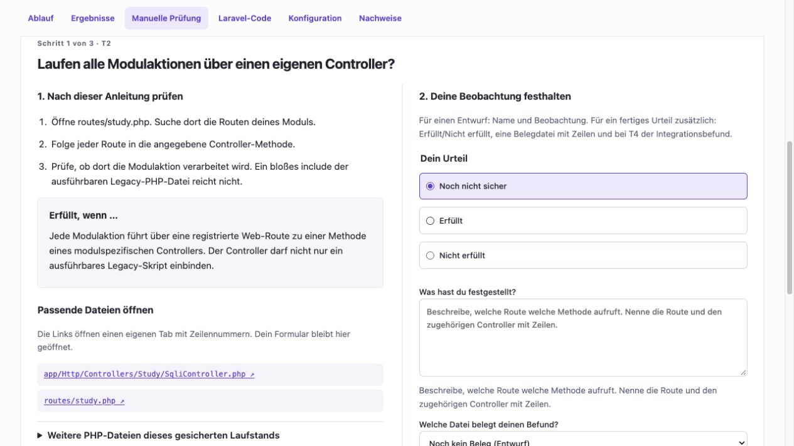

# Prüfung der Forschungsumgebung am 06.10.2026

## Auftrag, Bezugsstand und Aussagegrenze

Geprüft wurde die technische Umsetzung des vom Nutzer vorgelegten Forschungsplans: Rollen und Kontextbedingungen, unabhängige Bewertung, vollständige Protokollierung, deskriptive Auswertung, CSV/Grafiken, Bedienung und Installation. Ausgangscommit des Entwicklungsrepositories: `95dcebdb866dc6e4e2a76a3400e7d562c875a561`. Die acht tatsächlich herangezogenen Planungsdateien sind mit SHA-256 in [plan-inputs.json](plan-inputs.json) gebunden. Maßgeblich ist dort insbesondere `005-Forschungsablauf/01-Operationalisierung-und-Auswertungsplan.md`, Abschnitte 3–9; der Forschungsablauf konkretisiert in Abschnitten 5–8 Freeze, Durchführung und Sicherung.

Dies ist eine technische Prüfung und eine eigene Einschätzung der Eignung für die Bachelorarbeit. Sie ist keine neue Validierung sämtlicher Literaturquellen, kein Gutachten der Hochschule und keine menschliche Fachabnahme der Messinstrumente. Tatsächliche Modellmesswerte, synthetische Testdaten und eigene Bewertungen werden unten getrennt ausgewiesen. Das Manuskript wurde nicht verändert.

## Abgleich mit dem geplanten Verfahren

| Planvorgabe | Umsetzung / Prüfstelle | Ergebnis |
| --- | --- | --- |
| 12 Konfigurationen, 6r_C+6r_E, r_E≤r_C | `domain.py`, `matrix.py`, Register-/Matrix- und Analysetests | Kern und Zusatzmatrix vorhanden; SQL/K1-A/A wird als derselbe Lauf referenziert. Geplante, nicht gestartete IDs bleiben im Export. |
| K0/K1 und Rollen P/V | `context_assets.py`, `role_formats.py`, `pipeline.py`, tatsächlicher Cross-Model-Lauf unten | P bedient Analyzer/Planner/Migrate/Repair, V Test/Review. Übergaben sind laufgebunden; keine externe Bewertungsrückmeldung an Rollen. |
| Interne Tests als Intervention; Bewertung erst nach Seal | Pipeline-/Sandbox-/Evaluator-/Leakagetests | Getrennte Artefaktbereiche und Messungen. Mehrdatei-Testfehler gefunden und korrigiert. |
| F=T×ΣR/6, fachliche Null vs. fehlende Messung | `analysis.py`, Gegenbeispiele in `tests/test_analysis.py` | Gleich gewichtete R-Kategorien, bekanntes T=0 setzt F=0; offene Kriterien bleiben offen. Kein Ersatz fehlender menschlicher Urteile. |
| Vollständige Kernblöcke und UF1-Modulkontraste | `analysis.py`, `analysis_metrics.py`, `tests/test_research_audit.py` | Gemeinsame Blöcke, zusätzliche Modulpaare und Modulunterschiede getrennt. |
| UF3/UF4 nur auf vorab festgelegten Zusatzblöcken | `analysis_charts.py`, `analysis_metrics.py` | Zu große A/A-Bezugsgruppe in Grafiken korrigiert. F sowie D/L/S verwenden die zutreffenden Gruppen und eigene gültige Nenner. |
| UF5 Ressourcen und Kosten | `analysis_resources.py`, `analysis_metrics.py`, Lauf-/Transport-/Zeittabellen | Aktive Zeit, Pausen/Ausfälle, Rollen, Transporte, Repair, einzelne Tokenkategorien und Währungen getrennt. Fehlende Angaben werden nicht als kostenlos oder null behandelt. |
| UF6 Streuung, deskriptive H-K-Einordnung | `analysis.py`, `analysis_charts.py` | n, Mittelwert, Median, Min/Max, Stichproben-s; Leave-one-out und Fehlwertgrenzen. Keine p-Werte, Konfidenzintervalle oder automatische Hypothesenbestätigung. |
| Vollständige auswertbare Exporte je Reihe/Lauf | `analysis_tables.py`, `analysis_export.py`, `run_export.py`, `exchange.py` | Laufübersicht, Einzelbelege, Zusammenfassungen, Sensitivität sowie verlustfreie JSON-Daten; Originale zusätzlich im geprüften Studienpaket. |
| Einfache Prüferinstallation | `start.sh`, `compose.installed.yaml` | Neue eigene Datenvolumes und Start über einen Befehl nativ geprüft; installationsbezogene Image-Bindungen erforderlich. |

Die technische Zuordnung der Fragen ist in der [Bedienanleitung](../../../README.md#auswertung-und-verwendung-im-manuskript) erläutert. UF2 ist der unmittelbare Kontextvergleich; ergänzende Kriterien- und Fehlerprofile erklären dessen Ergebnisse. Interpretation, fachliche Freigaben und die Reichweite der Befunde bleiben Aufgaben des Forschenden.

## Gefundene und behobene Probleme

1. **Echte Holdout-Kataloge wurden am falschen Standardpfad gesucht.** Der synthetische Testkatalog hatte diesen Fehler verdeckt. Der Projektwurzelpfad wurde korrigiert; ein zusätzlicher Test lädt die tatsächlichen eingefrorenen Kataloge mit BF=16, SQL=10 und UP=9 Fällen.
2. **Zwei explorative Grafiken enthielten A/A-Referenzwerte außerhalb B_E.** Bei r_C>r_E hätten Grafik und Vergleich unterschiedliche Bezugsgruppen gezeigt. Beide Darstellungen sind auf die vorab festgelegten Zusatzblöcke beschränkt; ein asymmetrisches 3/1-Gegenbeispiel prüft dies.
3. **Einige geplante Auswertungen fehlten als direkt nutzbare Ergebnisse.** Ergänzt wurden Modulkontraste, UF3-/UF4-D/L/S-Vergleiche, Erfolgs-/T-/R-Profile sowie Token-, Rollen-, Transport- und Repairvergleiche. Fehlwertregeln und statistischer Anspruch wurden nicht verändert.
4. **CSV-Dateien waren für die praktische Auswertung zu verschachtelt und Einzelrun-CSV unvollständig.** Es gibt nun `runs.csv` mit einer Zeile je geplanter ID, normalisierte Tabellen für Aufrufe, Token, Intervalle, Fälle, Assertions und Reviews sowie `summaries.csv`/`sensitivity.csv`. Exakte Brüche bleiben neben Dezimaldarstellungen erhalten. Einzelrun-CSV führt zusätzlich jeden JSON-Einzelwert über einen eindeutigen JSON-Pointer-Pfad auf.
5. **Kein eigenständiger Studienpaket-Import mit schlüsselfreier Nachrechnung.** Ergänzt wurden persistierte Exportaufträge, überprüfte ZIP-Archive, isolierte Imports und Nachrechnung mit exakt passender installierter Analyseversion. Prüfsummen, Referenzen, Pfade und Ausgabezuordnungen werden kontrolliert. Archive werden nicht als ausführbarer Code geladen. Große Dateien werden beim Prüfen/Kopieren blockweise verarbeitet.
6. **Mehrere interne Testdateien verloren ihre Dateinamen.** Die frühere `eval`-Zusammenführung brach relative `require_once`-Verweise und PHP-Dateisemantik. Neue Testpakete bewahren die originalen Pfade/Bytes und laufen auf einem schreibgeschützt gemounteten Testvolume. Historische Skriptartefakte bleiben unverändert. Native Positiv-, Exception- und ParseError-Gegenproben bestanden.
7. **Installation setzte lokale Entwicklungs-Image-IDs voraus.** `start.sh` baut die tatsächlichen Laufzeitimages und bindet deren IDs. Auch die statische Analyse verwendet jetzt diese installierte ID; Versions-, PHPStan-/Larastan- und Vendor-Byteprüfungen bleiben bestehen. Der Betriebsstatus prüft die tatsächlich verwendeten vier Images.
8. **Abweichende blaue Auswahl-/Lauf-/Fokusfarben.** Interaktionszustände benutzen jetzt die gemeinsamen violetten Variablen; K0 ist neutral markiert. Browsernachweis: Radio-Akzent/Rahmen `rgb(109,66,207)`, Auswahlhintergrund `rgb(241,236,252)`. Kein manuelles Fachurteil wurde bei der Farbprüfung gespeichert.
9. **Repair-Zählung bei Unterbrechungen.** Nur vorbereitete Aufrufe wurden zuvor bereits als ausgeführter Repair gezählt. Die Ableitung verlangt jetzt einen belegten Versandbeginn; Transportwiederholungen zählen denselben logischen Repair nicht mehrfach. Fehlende historische Versandbelege werden nicht als Null erfunden.
10. **Manuskriptübergabe und Bedienung.** PDF zusätzlich zu PNG/SVG, verständliche Erläuterungen zu Nennern, offenen Werten, CSV-Import, Ablauf, Archivierung und den Grenzen der Nachrechnung. Alte Ergebnisse werden dadurch nicht rückwirkend umgerechnet.

## Tatsächlich ausgeführter Cross-Model-Techniktest

Der Nutzer genehmigte ausdrücklich genau einen kostenpflichtigen Lauf: „Ja, diesen einen kostenpflichtigen Lauf starten“. Es wurde kein weiterer bezahlter Test gestartet.

| Merkmal | Gespeicherter Befund |
| --- | --- |
| Lauf | `cbbba2f4-4ef2-4c2d-a329-b3701db3894f` |
| Konfiguration | `11340ca8-66b3-4337-927b-e5abe5ff2674`, SQL/K1, Planner und Review an |
| P | `openai/gpt-6.1-sol`, fester OpenAI-Endpunkt |
| V | `anthropic/claude-sonnet-4.5`, fester Anthropic-Endpunkt |
| Tatsächliche Rollenaufrufe | 6: Analyzer, Planner, Migrate, Test, Review, Repair; jeweils ein Transportversuch |
| Native gemeldete Kosten | 2,6551155 USD; keine ungeprüfte Umrechnung in EUR |
| Aktive Pipelinezeit | Rund 403,4 s laut gespeichertem Ressourcenprofil |
| Kandidatenhash | `3f4905b57d5f40d1ddaba740bb40f49012d494ca9c2751fc7458922082abb961` |
| Unabhängige öffentliche Entwicklungsfälle | 10/10 bestanden, R1–R6 jeweils 1; dies sind keine Hauptdaten |
| Statische Messung | D=0, L=35, S=0 |
| Interner Befund | Hilfsdatei `sql_test_helpers.php` wurde durch den damaligen Wrapper nicht materialisiert. Fehler vor/nach Repair erhalten. |
| Fachlicher Gesamtwert | T2–T4 offen; deshalb kein vollständiges F und keine menschliche Freigabe |

Die tatsächliche Modell-/Providerzuordnung wurde anhand der gespeicherten Aufruf- und Antwortbelege geprüft. Aktuelle öffentliche Metadaten wurden vor dem Lauf nativ mit Abrufdatum und Hash gesichert: `docs/quellen/openrouter/2026-10-06/cross-model-pruefung/`. Quelle: die OpenRouter-Modellendpunkte für beide konkreten Modelle. Die Tests belegen die technische Verwendung unterschiedlicher Rollenmodelle, weder deren allgemeine Zuverlässigkeit noch einen Vorteil einer Zuordnung.

Originalartefakte bleiben in der bestehenden lokalen Installation unter **Testläufe → Prüfung 06.10.2026 · Cross-Model SQL K1 · GPT / Claude → Nachweise**. Die Lauf-ID erlaubt eindeutige Zuordnung. Die Korrektur des internen Runners verändert diesen Versuch nicht; nach der Korrektur wurden nur kostenfreie Prüfungen durchgeführt.

## Technische Nachweise

- Ausgangsregression: **638 bestanden**, [Log](baseline.log), [JUnit](baseline.xml).
- Erste vollständige Regression nach Auswertungs-, Archiv-, Runner- und Bedienkorrekturen: **655 bestanden**, [Log](final-regression.log), [JUnit](final-regression.xml).
- Anschließende gezielte Robustheits-/Status-/Workflowprüfung: **48 bestanden**, [Log](followup.log), [JUnit](followup.xml).
- Vollregression nach dem im nativen Erstbetrieb entdeckten statischen Image-Fehler: **656 bestanden**, [Log](release-regression.log), [JUnit](release-regression.xml).
- Abschließende Ressourcen-/Analyse-/Archiv-Gegenproben nach Präzisierung der Repair-Zählung: **92 bestanden**, [Log](dispatch-regression.log), [JUnit](dispatch-regression.xml).
- Mehrdatei-Testrunner im realen PHP-Container: Hilfsdatei und `strict_types` erfolgreich (Exit 0), absichtliche Exception und Syntaxfehler jeweils Exit 1, [Originalbefunde](internal-native.json).
- Kostenfreie SQL-Demo auf separaten neuen Volumes: erste Generierung/Seal erfolgreich; unabhängige Prüfung erkennt korrekt den absichtlich leeren Demo-Modulcode (404); statische Messung legte den installationsabhängigen Image-Fehler offen. Der korrigierte Kontrolllauf `3457ab97-0464-4ebd-b3bb-4b59c37ed1ed` beendet Funktions-, Integrations- und statische Messung jeweils mit Exit 0; D=0, L=0, S entsprechend `L_zero` undefiniert. [Gesicherte Messungs-IDs und Werte](native-install.json).
- Eigenständiges synthetisches Archiv mit 48 geplanten IDs: 626 Dateien, 3.382.925 Bytes, Paket-ID `927538aa-34be-42ff-8e82-1b41cf52e08b`, SHA-256 `81a5ea5160924929d10ee65c28c6bd850822e5a08fe63accddc0b34c791d4a27`. Import über echte Browseroberfläche in die neue Installation erfolgreich, Nachrechnung stimmt exakt mit dem bestätigten Ergebnis überein; Archivhash unverändert und **0 reale Modellaufrufe** in dieser Installation. Die Daten enthalten bewusst fehlende Werte; keine empirische Studie und keine erfundenen vollständigen Blöcke.
- Erste Regression der bereinigten Veröffentlichung: 654 bestanden, zwei Fehler wegen einer beim Kopieren ausgelassenen lokalen HTMX-Bibliothek ([Log](clean-copy-regression.log)). Die Bibliothek samt Lizenz wurde ergänzt; die abschließende Vollregression des korrigierten Veröffentlichungsbestands besteht mit **657 Tests** ([Log](public-regression.log), [JUnit](public-regression.xml)).
- Diagramme mit leeren und gefüllten synthetischen Daten visuell geprüft: Beschriftungen, fehlende Werte, tatsächliche Blocknummern, Einzelpunkte und n-Angaben. PDF-/PNG-/SVG-Dateien stammen aus derselben Berechnung.
- Bestehende lokale Installation unter Port 8156 datenerhaltend aktualisiert, zuvor konsistente SQLite-Snapshots. Danach alle **22 vorhandenen Lauf-IDs erhalten**, `integrity_check=ok`, kein neuer Modelllauf gestartet. Aktuelle Grundlagen über die Oberfläche registriert.
- Bereinigter Veröffentlichungsbestand zusätzlich mit `COMPOSE_PROJECT_NAME=research-audit-public-20261006 RESEARCH_PORT=8163 ./start.sh` auf eigenen neuen Volumes gestartet: beide Dienste gesund, alle Betriebszustände verfügbar, lokale HTMX-Datei mit erwartetem Hash erreichbar, **0 reale Modellaufrufe**. [Statusnachweis](public-start.json).
- Runtime-, Asset-, Test- und Skriptdateien des bereinigten Bestands mit dem Entwicklungsstand bytegleich verglichen; [SHA-256-Liste](tested-source-files.json). README-/Prüfbericht-Dateiverweise auf vorhandene Ziele geprüft. Schlüsseldateien, alte Laufdaten und Git-Historie sind ausgeschlossen; die zusätzliche Musterprüfung fand keine echten Credential-Formate.

Geprüfte Plattform: macOS-Host mit Docker Desktop 4.93.0, Engine 29.8.1, Linux/ARM64, Python 3.13.16. Die bereinigte Installationskopie enthielt zunächst etwa 6,1 MB Software/Assets und keine alte Git-Historie oder Laufdaten. Sie nutzte einen eigenen Compose-Projektnamen und neue Volumes auf demselben Docker-Daemon; vorhandene Registry-/Buildcaches wurden nicht gelöscht. Dies ist kein Nachweis einer zweiten physischen Maschine.

## Technischer Abschluss und Veröffentlichungsstand

**Eigene technische Einschätzung nach den dokumentierten Prüfungen:** Die korrigierte Umgebung ist auf der geprüften Plattform für den vorgesehenen Ablauf einschließlich Vorbereitung, Piloten, Freeze, Erhebung und Auswertung einsetzbar. Es ist kein aus diesen Prüfungen bekannter kritischer Softwarefehler offen. Dies ist eine begrenzte technische Aussage; die unten genannten Voraussetzungen für eine konkrete Haupterhebung bleiben bestehen.

Der bereinigte Bestand wird gemäß Nutzerauftrag als [Bachelorarbeit-Forschungsumgebung-Public](https://github.com/nofiedler/Bachelorarbeit-Forschungsumgebung-Public) mit genau einem Ausgangscommit bereitgestellt. Inhalt: Anwendung, versionierte Eingaben, Verträge, Tests, Startskript und dieser kompakte Prüfbericht. Alte Entwicklungsdaten, Git-Historie, Issues und Schlüssel werden nicht übernommen. Die vollständige Regression und der native Erststart oben beziehen sich auf diesen Softwarebestand; die SHA-256-Liste bindet ihn unabhängig vom später erzeugten Git-Commit.

## Eignung für eine Bachelorarbeit und verbleibende Entscheidungen

**Eigene Einschätzung:** Das eingegrenzte Vorhaben ist einer Bachelorarbeit angemessen. Die Umgebung erfasst mehr technische Provenienz als für einfache Vergleiche üblich nötig wäre; entscheidend sind jetzt ein stabiler Versuchsstand, korrekt beurteilte Kriterien und eine transparente Interpretation. Weitere zusätzliche Metriken oder Modelloptimierung sind für diesen Plan nicht erforderlich. Die Software kann geplante Vergleiche berechnen, ersetzt aber keine hinreichenden beobachteten Daten: bei fehlenden Urteilen, fehlenden Blöcken oder r<2 bleiben bestimmte Aussagen beziehungsweise Streuungen offen.

Vor einer konkreten Haupterhebung sind weiterhin die im Forschungsablauf Abschnitt 5 geforderten menschlichen Fachprüfungen, technischen Modell-/Variantenpiloten, A/B- und Parameterentscheidung, r_C/r_E, Kostenfreigabe, Freeze und die bestätigte externe Ablage erforderlich. Diese Prüfung hat keine dieser menschlichen Entscheidungen vorweggenommen. Die Entwicklungstest-Ergebnisse dürfen nicht als Haupterhebungsdaten oder als Bestätigung von H-K übernommen werden.

Ein Studienpaket enthält keine Docker-Imagearchive und ist kein vollständiges Instanzbackup. Ein physisch unabhängiger Restore und der native Betrieb auf der tatsächlichen Prüferplattform sind hier nicht nachgewiesen. Der Quellstand der historischen Analyse und die tatsächlich verwendeten Images müssen zur Archivierung gesondert erhalten bleiben. Solche Grenzen sind in der Bedienanleitung sichtbar, keine stillen Garantien.

